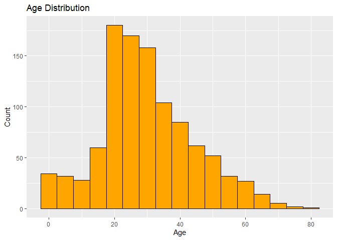
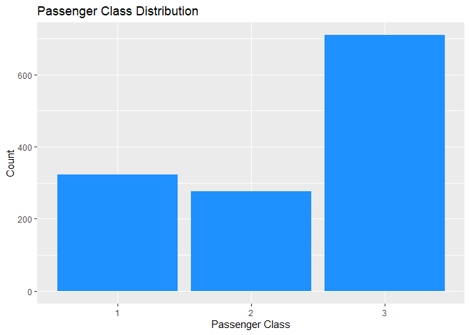
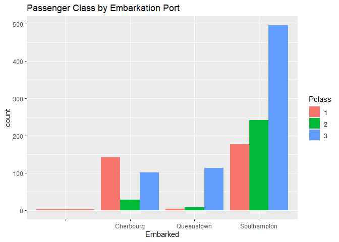
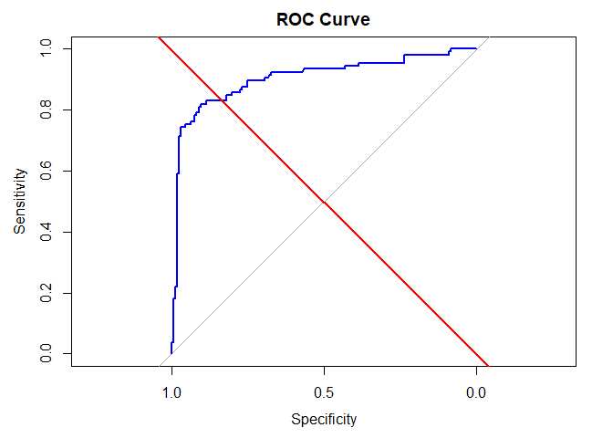
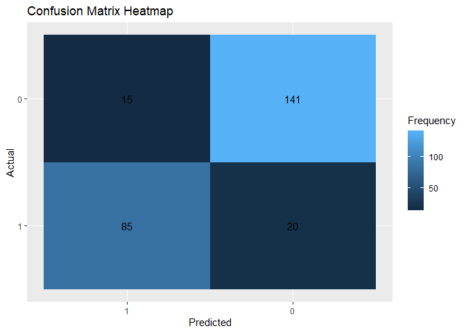

================
Rodillas
2025-05-03

# FA 5. Data Mining and Wrangling

### Classification via Logistic Regression

Objective: The objective of this assessment is to develop an
understanding of logistic regression and its application in binary
classification tasks. You will implement logistic regression using the
Titanic dataset, analyze model performance, and interpret the results.

## Dataset: Titanic Dataset

``` r
titanic_test <- read.csv("E:/Downloads/test.csv")
titanic_train <- read.csv("E:/Downloads/train.csv")
titanic_gender <- read.csv("E:/Downloads/gender_submission.csv")
```

## Data Preprocessing

``` r
head(titanic_test)
```

    ##   PassengerId Pclass                                         Name    Sex  Age
    ## 1         892      3                             Kelly, Mr. James   male 34.5
    ## 2         893      3             Wilkes, Mrs. James (Ellen Needs) female 47.0
    ## 3         894      2                    Myles, Mr. Thomas Francis   male 62.0
    ## 4         895      3                             Wirz, Mr. Albert   male 27.0
    ## 5         896      3 Hirvonen, Mrs. Alexander (Helga E Lindqvist) female 22.0
    ## 6         897      3                   Svensson, Mr. Johan Cervin   male 14.0
    ##   SibSp Parch  Ticket    Fare Cabin Embarked
    ## 1     0     0  330911  7.8292              Q
    ## 2     1     0  363272  7.0000              S
    ## 3     0     0  240276  9.6875              Q
    ## 4     0     0  315154  8.6625              S
    ## 5     1     1 3101298 12.2875              S
    ## 6     0     0    7538  9.2250              S

``` r
head(titanic_train)
```

    ##   PassengerId Survived Pclass
    ## 1           1        0      3
    ## 2           2        1      1
    ## 3           3        1      3
    ## 4           4        1      1
    ## 5           5        0      3
    ## 6           6        0      3
    ##                                                  Name    Sex Age SibSp Parch
    ## 1                             Braund, Mr. Owen Harris   male  22     1     0
    ## 2 Cumings, Mrs. John Bradley (Florence Briggs Thayer) female  38     1     0
    ## 3                              Heikkinen, Miss. Laina female  26     0     0
    ## 4        Futrelle, Mrs. Jacques Heath (Lily May Peel) female  35     1     0
    ## 5                            Allen, Mr. William Henry   male  35     0     0
    ## 6                                    Moran, Mr. James   male  NA     0     0
    ##             Ticket    Fare Cabin Embarked
    ## 1        A/5 21171  7.2500              S
    ## 2         PC 17599 71.2833   C85        C
    ## 3 STON/O2. 3101282  7.9250              S
    ## 4           113803 53.1000  C123        S
    ## 5           373450  8.0500              S
    ## 6           330877  8.4583              Q

``` r
head(titanic_gender)
```

    ##   PassengerId Survived
    ## 1         892        0
    ## 2         893        1
    ## 3         894        0
    ## 4         895        0
    ## 5         896        1
    ## 6         897        0

Since all dataset have PassengerId,we can complete the data as:

``` r
titanic_test <- merge(titanic_test, titanic_gender, by = "PassengerId")

titanic_train <- titanic_train[, colnames(titanic_test)]

titanic_data <- rbind(titanic_train, titanic_test)
```

``` r
head(titanic_data)
```

    ##   PassengerId Pclass                                                Name    Sex
    ## 1           1      3                             Braund, Mr. Owen Harris   male
    ## 2           2      1 Cumings, Mrs. John Bradley (Florence Briggs Thayer) female
    ## 3           3      3                              Heikkinen, Miss. Laina female
    ## 4           4      1        Futrelle, Mrs. Jacques Heath (Lily May Peel) female
    ## 5           5      3                            Allen, Mr. William Henry   male
    ## 6           6      3                                    Moran, Mr. James   male
    ##   Age SibSp Parch           Ticket    Fare Cabin Embarked Survived
    ## 1  22     1     0        A/5 21171  7.2500              S        0
    ## 2  38     1     0         PC 17599 71.2833   C85        C        1
    ## 3  26     0     0 STON/O2. 3101282  7.9250              S        1
    ## 4  35     1     0           113803 53.1000  C123        S        1
    ## 5  35     0     0           373450  8.0500              S        0
    ## 6  NA     0     0           330877  8.4583              Q        0

``` r
colSums(is.na(titanic_data))
```

    ## PassengerId      Pclass        Name         Sex         Age       SibSp 
    ##           0           0           0           0         263           0 
    ##       Parch      Ticket        Fare       Cabin    Embarked    Survived 
    ##           0           0           1           0           0           0

With the data processed, we can try to implement other EDA methods to
visualize the data

``` r
ggplot(titanic_data, aes(x = Age)) +
  geom_histogram(binwidth = 5, fill = "orange", color = "black", bins = 10) +
  labs(title = "Age Distribution", x = "Age", y = "Count")
```

    ## Warning: Removed 263 rows containing non-finite outside the scale range
    ## (`stat_bin()`).

<!-- -->

**Figure 1.** Age Distribution

Figure 1 shows the distribution of ages for the passengers of the
Titanic. Most of the passengers of the titanic are around the ages of
20-30, peaking at around 20, since most of the people there are young
adults. After the peak, however, the count of each age range slightly
decrements, with the oldest of age at around 80.

``` r
ggplot(titanic_data, aes(x = factor(Pclass))) +
  geom_bar(fill = "dodgerblue") +
  labs(x = "Passenger Class", y = "Count", title = "Passenger Class Distribution")
```

<!-- -->

**Figure 2.** Passenger Class Distribution

Figure 2 shows the number of each passenger belonging in the Titanic.
According to the data, most of the passengers are among the high class
people, obviously since at that time, the Titanic was actually built for
wealthy and luxurious people. With class 3 at around 700, it shows that
the titanic were dominated by the rich. On the other hand, around 300 of
the passengers were among the lower class, while a closely followed 200+
are from the 2nd class.

``` r
ggplot(titanic_data, aes(x = factor(Embarked), fill = factor(Pclass))) +
  geom_bar(position = "dodge") +
  labs(title = "Passenger Class by Embarkation Port", x = "Embarked", fill = "Pclass") +
  scale_x_discrete(labels = c("C" = "Cherbourg", "Q" = "Queenstown", "S" = "Southampton"))
```

<!-- -->

**Figure 3.** Embarkation place based on each Passenger Class

The Figure shows each spread of the passenger class from each place.
Most of the passengers were boarded on the Southampton, where most of
the higher class at around 500 were from. In addition, Cherbourg also
boarded a few passengers, where it is mostly from the lower class,
around 50 more than the upper class. Lastly, only a few passengers
embarked on Queenstown, but it is almost exclusive to the rich and
wealthy, as there is little to no passengers from class 1 and 2.

Going back to the cleaning of data:

Since there is only a singular value for Fare, we can remove the 1 NA
value in Fare to prevent any problems and clean the age by taking the
mean to not have a problem in analyzing the data.

``` r
titanic_data$Age[is.na(titanic_data$Age)] <- median(titanic_data$Age, na.rm = TRUE)

titanic_data <- titanic_data[!is.na(titanic_data$Fare), ]
colSums(is.na(titanic_data))
```

    ## PassengerId      Pclass        Name         Sex         Age       SibSp 
    ##           0           0           0           0           0           0 
    ##       Parch      Ticket        Fare       Cabin    Embarked    Survived 
    ##           0           0           0           0           0           0

``` r
exclude_cols <- c("Ticket", "PassengerId", "Name", "Fare")

for (col in setdiff(names(titanic_data), exclude_cols)) {
  cat("----", col, "----\n")
  print(unique(titanic_data[[col]]))
  cat("\n")
}
```

    ## ---- Pclass ----
    ## [1] 3 1 2
    ## 
    ## ---- Sex ----
    ## [1] "male"   "female"
    ## 
    ## ---- Age ----
    ##  [1] 22.00 38.00 26.00 35.00 28.00 54.00  2.00 27.00 14.00  4.00 58.00 20.00
    ## [13] 39.00 55.00 31.00 34.00 15.00  8.00 19.00 40.00 66.00 42.00 21.00 18.00
    ## [25]  3.00  7.00 49.00 29.00 65.00 28.50  5.00 11.00 45.00 17.00 32.00 16.00
    ## [37] 25.00  0.83 30.00 33.00 23.00 24.00 46.00 59.00 71.00 37.00 47.00 14.50
    ## [49] 70.50 32.50 12.00  9.00 36.50 51.00 55.50 40.50 44.00  1.00 61.00 56.00
    ## [61] 50.00 36.00 45.50 20.50 62.00 41.00 52.00 63.00 23.50  0.92 43.00 60.00
    ## [73] 10.00 64.00 13.00 48.00  0.75 53.00 57.00 80.00 70.00 24.50  6.00  0.67
    ## [85] 30.50  0.42 34.50 74.00 22.50 18.50 67.00 76.00 26.50 11.50  0.33  0.17
    ## [97] 38.50
    ## 
    ## ---- SibSp ----
    ## [1] 1 0 3 4 2 5 8
    ## 
    ## ---- Parch ----
    ## [1] 0 1 2 5 3 4 6 9
    ##
    ## ---- Cabin ----
    ##   [1] ""                "C85"             "C123"            "E46"            
    ##   [5] "G6"              "C103"            "D56"             "A6"             
    ##   [9] "C23 C25 C27"     "B78"             "D33"             "B30"            
    ##  [13] "C52"             "B28"             "C83"             "F33"            
    ##  [17] "F G73"           "E31"             "A5"              "D10 D12"        
    ##  [21] "D26"             "C110"            "B58 B60"         "E101"           
    ##  [25] "F E69"           "D47"             "B86"             "F2"             
    ##  [29] "C2"              "E33"             "B19"             "A7"             
    ##  [33] "C49"             "F4"              "A32"             "B4"             
    ##  [37] "B80"             "A31"             "D36"             "D15"            
    ##  [41] "C93"             "C78"             "D35"             "C87"            
    ##  [45] "B77"             "E67"             "B94"             "C125"           
    ##  [49] "C99"             "C118"            "D7"              "A19"            
    ##  [53] "B49"             "D"               "C22 C26"         "C106"           
    ##  [57] "C65"             "E36"             "C54"             "B57 B59 B63 B66"
    ##  [61] "C7"              "E34"             "C32"             "B18"            
    ##  [65] "C124"            "C91"             "E40"             "T"              
    ##  [69] "C128"            "D37"             "B35"             "E50"            
    ##  [73] "C82"             "B96 B98"         "E10"             "E44"            
    ##  [77] "A34"             "C104"            "C111"            "C92"            
    ##  [81] "E38"             "D21"             "E12"             "E63"            
    ##  [85] "A14"             "B37"             "C30"             "D20"            
    ##  [89] "B79"             "E25"             "D46"             "B73"            
    ##  [93] "C95"             "B38"             "B39"             "B22"            
    ##  [97] "C86"             "C70"             "A16"             "C101"           
    ## [101] "C68"             "A10"             "E68"             "B41"            
    ## [105] "A20"             "D19"             "D50"             "D9"             
    ## [109] "A23"             "B50"             "A26"             "D48"            
    ## [113] "E58"             "C126"            "B71"             "B51 B53 B55"    
    ## [117] "D49"             "B5"              "B20"             "F G63"          
    ## [121] "C62 C64"         "E24"             "C90"             "C45"            
    ## [125] "E8"              "B101"            "D45"             "C46"            
    ## [129] "D30"             "E121"            "D11"             "E77"            
    ## [133] "F38"             "B3"              "D6"              "B82 B84"        
    ## [137] "D17"             "A36"             "B102"            "B69"            
    ## [141] "E49"             "C47"             "D28"             "E17"            
    ## [145] "A24"             "C50"             "B42"             "C148"           
    ## [149] "B45"             "B36"             "A21"             "D34"            
    ## [153] "A9"              "C31"             "B61"             "C53"            
    ## [157] "D43"             "C130"            "C132"            "C55 C57"        
    ## [161] "C116"            "F"               "A29"             "C6"             
    ## [165] "C28"             "C51"             "C97"             "D22"            
    ## [169] "B10"             "E45"             "E52"             "A11"            
    ## [173] "B11"             "C80"             "C89"             "F E46"          
    ## [177] "B26"             "F E57"           "A18"             "E60"            
    ## [181] "E39 E41"         "B52 B54 B56"     "C39"             "B24"            
    ## [185] "D40"             "D38"             "C105"           
    ## 
    ## ---- Embarked ----
    ## [1] "S" "C" "Q" "" 
    ## 
    ## ---- Survived ----
    ## [1] 0 1

Looking at the unique values, one of the passenger have a blank value
for a cabin, which could indicate that he was not given a cabin in the
Titanic, or possibly a Stowaway, or a Steewage. Let’s have the value of
a non-cabin passenger value to **S** for **“stowaway”, or “Steewage”**.

``` r
titanic_data$Cabin[is.na(titanic_data$Cabin)] <- "S"
titanic_data$Deck <- substr(titanic_data$Cabin, 1, 1)
```

Since we are testing the data, we will be changing the variable of the
Sex to a numerical

``` r
titanic_data$Sex <- as.character(titanic_data$Sex)

titanic_data$Sex <- ifelse(titanic_data$Sex == "male", 1, 0)

str(titanic_data)
```

    ## 'data.frame':    1308 obs. of  13 variables:
    ##  $ PassengerId: int  1 2 3 4 5 6 7 8 9 10 ...
    ##  $ Pclass     : int  3 1 3 1 3 3 1 3 3 2 ...
    ##  $ Name       : chr  "Braund, Mr. Owen Harris" "Cumings, Mrs. John Bradley (Florence Briggs Thayer)" "Heikkinen, Miss. Laina" "Futrelle, Mrs. Jacques Heath (Lily May Peel)" ...
    ##  $ Sex        : num  1 0 0 0 1 1 1 1 0 0 ...
    ##  $ Age        : num  22 38 26 35 35 28 54 2 27 14 ...
    ##  $ SibSp      : int  1 1 0 1 0 0 0 3 0 1 ...
    ##  $ Parch      : int  0 0 0 0 0 0 0 1 2 0 ...
    ##  $ Ticket     : chr  "A/5 21171" "PC 17599" "STON/O2. 3101282" "113803" ...
    ##  $ Fare       : num  7.25 71.28 7.92 53.1 8.05 ...
    ##  $ Cabin      : chr  "" "C85" "" "C123" ...
    ##  $ Embarked   : chr  "S" "C" "S" "S" ...
    ##  $ Survived   : int  0 1 1 1 0 0 0 0 1 1 ...
    ##  $ Deck       : chr  "" "C" "" "C" ...

To preprocess, normalize/standardized the data to obtain 99% on +-2

``` r
titanic_data <- titanic_data %>%
  mutate(across(c(Age, Fare, SibSp, Parch), scale))
```

``` r
set.seed(777)

trIndex <-createDataPartition(titanic_data$Survived,
                              p = 0.8,
                              list = FALSE)
train_data <- titanic_data[trIndex,]
test_data <- titanic_data[-trIndex,]
```

## Model Implementation

Implement Logistic Regression

``` r
glimpse(titanic_data)
```

    ## Rows: 1,308
    ## Columns: 13
    ## $ PassengerId <int> 1, 2, 3, 4, 5, 6, 7, 8, 9, 10, 11, 12, 13, 14, 15, 16, 17,…
    ## $ Pclass      <int> 3, 1, 3, 1, 3, 3, 1, 3, 3, 2, 3, 1, 3, 3, 3, 2, 3, 2, 3, 3…
    ## $ Name        <chr> "Braund, Mr. Owen Harris", "Cumings, Mrs. John Bradley (Fl…
    ## $ Sex         <dbl> 1, 0, 0, 0, 1, 1, 1, 1, 0, 0, 0, 0, 1, 1, 0, 0, 1, 1, 0, 0…
    ## $ Age         <dbl[,1]> <matrix[26 x 1]>
    ## $ SibSp       <dbl[,1]> <matrix[26 x 1]>
    ## $ Parch       <dbl[,1]> <matrix[26 x 1]>
    ## $ Ticket      <chr> "A/5 21171", "PC 17599", "STON/O2. 3101282", "113803",…
    ## $ Fare        <dbl[,1]> <matrix[26 x 1]>
    ## $ Cabin       <chr> "", "C85", "", "C123", "", "", "E46", "", "", "", "G6"…
    ## $ Embarked    <chr> "S", "C", "S", "S", "S", "Q", "S", "S", "S", "C", "S",…
    ## $ Survived    <int> 0, 1, 1, 1, 0, 0, 0, 0, 1, 1, 1, 1, 0, 0, 0, 1, 0, 1, 0, 1…
    ## $ Deck        <chr> "", "C", "", "C", "", "", "E", "", "", "", "G", "C", "…

``` r
titanic_lr1 <- glm(Survived ~ Pclass + Sex + Age + SibSp + Parch + Fare + Embarked + Deck, data = train_data,
                   family = "binomial")
summary(titanic_lr1)
```

    ## 
    ## Call:
    ## glm(formula = Survived ~ Pclass + Sex + Age + SibSp + Parch + 
    ##     Fare + Embarked + Deck, family = "binomial", data = train_data)
    ## 
    ## Coefficients:
    ##              Estimate Std. Error z value Pr(>|z|)    
    ## (Intercept)  14.30643  882.74361   0.016 0.987069    
    ## Pclass       -0.67278    0.18307  -3.675 0.000238 ***
    ## Sex          -3.76824    0.21734 -17.338  < 2e-16 ***
    ## Age          -0.47819    0.10676  -4.479 7.49e-06 ***
    ## SibSp        -0.38140    0.11698  -3.260 0.001113 ** 
    ## Parch        -0.06905    0.10006  -0.690 0.490162    
    ## Fare          0.09250    0.11830   0.782 0.434281    
    ## EmbarkedC   -11.30573  882.74353  -0.013 0.989781    
    ## EmbarkedQ   -11.08776  882.74357  -0.013 0.989978    
    ## EmbarkedS   -11.37937  882.74352  -0.013 0.989715    
    ## DeckA         1.04394    0.62892   1.660 0.096937 .  
    ## DeckB         0.95177    0.56010   1.699 0.089266 .  
    ## DeckC         0.80975    0.43702   1.853 0.063897 .  
    ## DeckD         1.20623    0.52655   2.291 0.021973 *  
    ## DeckE         2.07968    0.60823   3.419 0.000628 ***
    ## DeckF         0.65798    0.71553   0.920 0.357796    
    ## DeckG        -1.07394    1.25755  -0.854 0.393106    
    ## DeckT       -12.69338  882.74343  -0.014 0.988527    
    ## ---
    ## Signif. codes:  0 '***' 0.001 '**' 0.01 '*' 0.05 '.' 0.1 ' ' 1
    ## 
    ## (Dispersion parameter for binomial family taken to be 1)
    ## 
    ##     Null deviance: 1381.56  on 1046  degrees of freedom
    ## Residual deviance:  758.52  on 1029  degrees of freedom
    ## AIC: 794.52
    ## 
    ## Number of Fisher Scoring iterations: 13

``` r
pred_test1 <- predict(titanic_lr1, newdata = test_data, type = "response")

pred_classes <- ifelse(pred_test1 > 0.5, "Yes", "No")
```

``` r
pred_test1 <- predict(titanic_lr1, newdata = test_data, type = "response")
pred_classes <- ifelse(pred_test1 > 0.5, "1", "0")

pred_classes
```

    ##    3    5   16   20   30   33   38   40   44   49   54   64   76   80   84   85 
    ##  "1"  "0"  "1"  "1"  "0"  "1"  "0"  "1"  "1"  "0"  "1"  "0"  "0"  "1"  "0"  "1" 
    ##   91   93   95  106  107  127  132  133  137  151  157  158  163  171  177  185 
    ##  "0"  "0"  "0"  "0"  "1"  "0"  "0"  "1"  "1"  "0"  "1"  "0"  "0"  "0"  "0"  "1" 
    ##  191  192  193  194  196  198  203  207  209  212  217  229  241  243  245  251 
    ##  "1"  "0"  "1"  "0"  "1"  "0"  "0"  "0"  "1"  "1"  "1"  "0"  "1"  "0"  "0"  "0" 
    ##  252  253  254  257  264  266  269  272  281  283  285  292  293  297  298  300 
    ##  "0"  "0"  "0"  "1"  "0"  "0"  "1"  "0"  "0"  "0"  "0"  "1"  "0"  "0"  "1"  "1" 
    ##  318  320  327  330  338  339  341  346  352  354  355  356  361  376  377  387 
    ##  "0"  "1"  "0"  "1"  "1"  "0"  "0"  "1"  "0"  "0"  "0"  "0"  "0"  "1"  "1"  "0" 
    ##  395  404  415  424  425  429  444  453  455  457  458  460  461  463  475  477 
    ##  "1"  "0"  "0"  "1"  "0"  "0"  "1"  "0"  "0"  "0"  "1"  "0"  "1"  "1"  "1"  "0" 
    ##  485  499  506  507  508  509  515  523  525  526  527  535  536  537  540  542 
    ##  "0"  "1"  "0"  "1"  "0"  "0"  "0"  "0"  "0"  "0"  "1"  "1"  "1"  "0"  "1"  "1" 
    ##  548  554  555  556  564  568  581  587  588  592  593  600  601  610  613  616 
    ##  "0"  "0"  "1"  "0"  "0"  "1"  "1"  "0"  "0"  "1"  "0"  "0"  "1"  "1"  "1"  "1" 
    ##  622  623  626  628  629  641  657  661  664  665  668  669  670  672  694  701 
    ##  "0"  "0"  "0"  "1"  "0"  "0"  "0"  "0"  "0"  "0"  "0"  "0"  "1"  "0"  "0"  "1" 
    ##  708  711  714  720  723  728  733  736  756  758  765  773  790  807  812  824 
    ##  "1"  "1"  "0"  "0"  "0"  "1"  "0"  "0"  "0"  "0"  "0"  "1"  "0"  "0"  "0"  "1" 
    ##  826  830  832  837  839  842  852  858  863  864  867  873  879  881  889  891 
    ##  "0"  "1"  "0"  "0"  "0"  "0"  "0"  "0"  "1"  "0"  "1"  "0"  "0"  "1"  "1"  "0" 
    ##  893  894  895  901  902  904  907  908  909  923  937  951  954  957  958  961 
    ##  "1"  "0"  "0"  "0"  "0"  "1"  "1"  "0"  "0"  "0"  "0"  "1"  "0"  "1"  "1"  "1" 
    ##  966  982  985  986  987  990  991  992 1021 1031 1035 1038 1039 1046 1049 1050 
    ##  "1"  "1"  "0"  "0"  "0"  "1"  "0"  "1"  "0"  "0"  "0"  "1"  "0"  "0"  "1"  "0" 
    ## 1051 1055 1068 1073 1080 1081 1083 1087 1089 1090 1117 1120 1121 1122 1129 1134 
    ##  "1"  "0"  "1"  "1"  "0"  "0"  "0"  "0"  "1"  "0"  "1"  "0"  "0"  "0"  "0"  "1" 
    ## 1144 1149 1153 1155 1159 1164 1178 1182 1186 1189 1193 1198 1200 1201 1203 1217 
    ##  "0"  "0"  "0"  "1"  "0"  "1"  "0"  "0"  "0"  "0"  "0"  "0"  "0"  "1"  "0"  "0" 
    ## 1232 1233 1241 1246 1250 1257 1262 1263 1266 1267 1270 1275 1286 1292 1298 1301 
    ##  "0"  "0"  "1"  "1"  "0"  "1"  "0"  "1"  "1"  "1"  "0"  "1"  "0"  "1"  "0"  "1" 
    ## 1304 1305 1306 1308 1309 
    ##  "1"  "0"  "1"  "0"  "0"

``` r
pred_classes_numeric <- as.numeric(pred_classes)
```

``` r
num_survived <- (sum(pred_classes_numeric) / nrow(test_data)) * 100
num_survived
```

    ## [1] 38.31418

Based on the test data, the predicted number of **survived passengers is
at 38.314%**

## Model Evaluation

Evaluating the prediction:

``` r
actual <- factor(test_data$Survived, levels = c("1", "0"))
predicted <- factor(pred_classes, levels = c("1", "0"))

model_performance <- confusionMatrix(predicted, actual)

model_performance 
```

    ## Confusion Matrix and Statistics
    ## 
    ##           Reference
    ## Prediction   1   0
    ##          1  85  15
    ##          0  20 141
    ##                                           
    ##                Accuracy : 0.8659          
    ##                  95% CI : (0.8185, 0.9048)
    ##     No Information Rate : 0.5977          
    ##     P-Value [Acc > NIR] : <2e-16          
    ##                                           
    ##                   Kappa : 0.719           
    ##                                           
    ##  Mcnemar's Test P-Value : 0.499           
    ##                                           
    ##             Sensitivity : 0.8095          
    ##             Specificity : 0.9038          
    ##          Pos Pred Value : 0.8500          
    ##          Neg Pred Value : 0.8758          
    ##              Prevalence : 0.4023          
    ##          Detection Rate : 0.3257          
    ##    Detection Prevalence : 0.3831          
    ##       Balanced Accuracy : 0.8567          
    ##                                           
    ##        'Positive' Class : 1               
    ## 

The **accuracy of the test data is around 85.59% on a 95% confidence
interval**. Since the p-value is at \<2e-16, which is less than the 0.05
threshold, then the model is **statistically significant**.

``` r
accuracy <- model_performance $overall["Accuracy"]
precision <- model_performance $byClass["Pos Pred Value"]
recall <- model_performance $byClass["Sensitivity"]

f1_score <- 2 * (precision * recall) / (precision + recall)

roc_curve <- roc(test_data$Survived, pred_test1)
```

    ## Setting levels: control = 0, case = 1

    ## Setting direction: controls < cases

``` r
auc_value <- auc(roc_curve)
```

``` r
cat("Model Performance Metrics:\n",
    "  Precision :", round(precision, 4), "\n",
    "  Recall    :", round(recall, 4), "\n",
    "  F1-Score  :", round(f1_score, 4), "\n",
    "  AUC Score :", round(auc_value, 4), "\n")
```

    ## Model Performance Metrics:
    ##    Precision : 0.85 
    ##    Recall    : 0.8095 
    ##    F1-Score  : 0.8293 
    ##    AUC Score : 0.9023

``` r
plot(roc_curve, col = "blue", main = "ROC Curve")
abline(a = 0, b = 1, col = "red", lwd = 2)
```

<!-- -->
**Figure 4.** ROC Curve

Looking at the ROC Curve, the blue ROC curve rises steeply toward the
top-left corner, indicating high sensitivity and specificity. In
addition, the Area Under the Curve is visually close to 1, suggesting
strong discrimination between classes. This model demonstrates strong
predictive ability, with a high true positive rate across various
thresholds.

``` r
table_data <- as.data.frame(model_performance$table)
colnames(table_data) <- c("Predicted", "Actual", "Frequency")

ggplot(data = table_data , aes(x = Predicted, y = Actual, fill = Frequency)) +
  geom_tile() +
  geom_text(aes(label = Frequency)) +
  labs(title = "Confusion Matrix Heatmap", x = "Predicted", y = "Actual") 
```

<!-- -->

**Figure 5.** Confusion Matrix Heatmap on the Acutal vs Predicted

Looking at confusion matrix heatmap above, it shows the **relatively
high accuracy of the model**. The model has **high precision and
recall**. The model **correctly predicted 85** positive cases, meaning
it successfully identified the survived passengers. The model also
**correctly predicted 141 negative cases** — the majority of actual
negatives were accurately detected. On the other hand, there are
instances where the model incorrectly predicted a positive outcome at
15, and 20 on the negative outcome. With these values, it shows that the
actual model have an acceptable prediction rate. Looking at the
**accuracy and precision**, both are in the near 90s at **86.6% and
85%** respectively, suggesting the model makes correct predictions most
of the time. In addition, with a **recall of 80.95%**, the model
successfully captures most positive instances, but misses about 19%.
Since both have relatively high values, the **F1 score of 0.8293**
suggests that the model achieves a good balance between precision and
recall. Overall, the logistic regression model provided an impressive
performance with an **AUC of 0.9023**, suggesting that the model has
**high discriminative power**, and is effect in ranking positive
instances.

Although the model has a relatively high performance, it is not perfect.
To possibly improve the model in the future, we can start by creating
better features, such as combining or transforming existing data, like
grouping ages or extracting titles from names. Handling class imbalance
is also important as it can help the model treat both classes more
fairly. Lastly, it is also applicable to adjust the prediction threshold
and using other evaluation tools.
