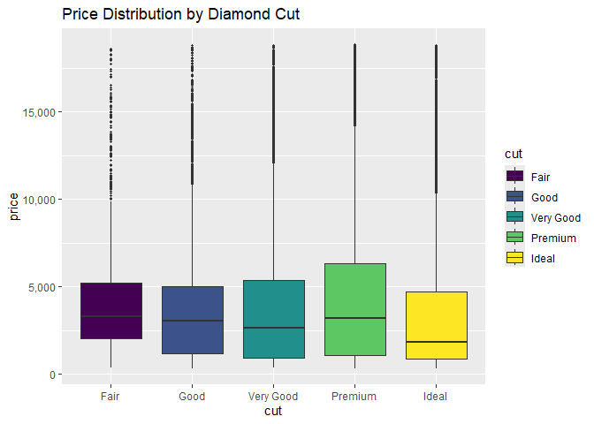

DSC1107_FA1_Rodillas
================
Rodillas
2025-02-02

# Data Mining and Wrangling

This lecture provides an introduction to data mining and wrangling. In
this overview, the unit 1 provides three necessary steps in
understanding data mining. 

**1. Data Visualization -** This provides a
graphical representation of data to easily discern and demonstrate the
data. Data visualization provides a number of insightful ideas such as
pattern and trends which necessary to make the data understandable and
easier to communicate it to. 

**2. Data Transformation -** This is a process
for data mining and wrangling that includes the preparation of data to
make it more compatible for tools and in a usable format and structure.
It ensures consistency in data and providing analysis for the given
numerical variables.  

**3. Data Wrangling -** It focuses on cleaning and creating a structure for
the data to be fit for a more understandable format for analysis. It
handles tasks such as missing values and improving the quality of the
data itself, reducing the risk of poor and inaccurate results.

## Data Visualization

## Case Study: Diamonds

The diamonds is a built in dataset that will be used for the variation
and implementation of different data visualization techniques.

``` r
library(tidyverse)
```

    ## ── Attaching core tidyverse packages ──────────────────────── tidyverse 2.0.0 ──
    ## ✔ dplyr     1.1.4     ✔ readr     2.1.5
    ## ✔ forcats   1.0.0     ✔ stringr   1.5.1
    ## ✔ ggplot2   3.5.1     ✔ tibble    3.2.1
    ## ✔ lubridate 1.9.4     ✔ tidyr     1.3.1
    ## ✔ purrr     1.0.2     
    ## ── Conflicts ────────────────────────────────────────── tidyverse_conflicts() ──
    ## ✖ dplyr::filter() masks stats::filter()
    ## ✖ dplyr::lag()    masks stats::lag()
    ## ℹ Use the conflicted package (<http://conflicted.r-lib.org/>) to force all conflicts to become errors

``` r
library(ggplot2)
diamonds
```

    ## # A tibble: 53,940 × 10
    ##    carat cut       color clarity depth table price     x     y     z
    ##    <dbl> <ord>     <ord> <ord>   <dbl> <dbl> <int> <dbl> <dbl> <dbl>
    ##  1  0.23 Ideal     E     SI2      61.5    55   326  3.95  3.98  2.43
    ##  2  0.21 Premium   E     SI1      59.8    61   326  3.89  3.84  2.31
    ##  3  0.23 Good      E     VS1      56.9    65   327  4.05  4.07  2.31
    ##  4  0.29 Premium   I     VS2      62.4    58   334  4.2   4.23  2.63
    ##  5  0.31 Good      J     SI2      63.3    58   335  4.34  4.35  2.75
    ##  6  0.24 Very Good J     VVS2     62.8    57   336  3.94  3.96  2.48
    ##  7  0.24 Very Good I     VVS1     62.3    57   336  3.95  3.98  2.47
    ##  8  0.26 Very Good H     SI1      61.9    55   337  4.07  4.11  2.53
    ##  9  0.22 Fair      E     VS2      65.1    61   337  3.87  3.78  2.49
    ## 10  0.23 Very Good H     VS1      59.4    61   338  4     4.05  2.39
    ## # ℹ 53,930 more rows

The diamonds is a built in dataset that will be used for the variation
and implementation of different data visualization techniques.It has a
built in columns that provides different information and data regarding
sets of diamonds.

## Variation

### a. Discrete Variables

``` r
ggplot(data = diamonds) + 
  geom_bar(mapping = aes(x = cut), color = "black", fill ="dodgerblue")
```

<!-- -->

**FIGURE 1**. The **bar chart** shows a straight-forward approach to the
count in relation to the cut of the diamonds. It is most notably used
for Discrete variables, meaning values that are countable in numerical
measures. On the graph, it shows the different kinds of cuts in a
diamond, namely **Ideal, Premium, Very Good, Good, and Fair**. Upon
observation on the graph given, the Ideal cut is the most common kind of
diamond cut at just above the 20000 count.

### b. Continuous Variables

``` r
ggplot(data = diamonds) +
geom_histogram(mapping = aes(x = carat), bins = 50, color = "black", fill = "lightgreen")
```

<!-- -->

**FIGURE 2**. On the other hand, the **histogram** chart notably shows
for measureable types of data, for which in this case, are the noted
carat of each diamond.

``` r
ggplot(data = diamonds) +
  geom_histogram(mapping = aes(x = carat), bins = 500, color = "dodgerblue") + scale_x_continuous(breaks = seq(0, max(diamonds$carat), by = 0.5))
```

<!-- -->

**FIGURE 3.** This is an adjusted **histogram** chart to narrow each
value of the carat, as well as spread on the x-axis for better
visualization. According to the graph, most of the diamonds, at around
2500 count, have around .25 carat. There are also a noticeable trend
that most diamonds have a “round” carat values as it is dominated by
diamonds on the 0.5, 1.0, 1.5 etc. carats, which may be greatly affected
by the market and its consumers.

## Covariation

Upon observation on the previous lesson, the covariation shows graphs to
represent observations between two variables present. The last topic
shows both carat and cut, but are analyzed in separate. The covaration
allows for a more versatile analysis between two of these variables.
\### a. Discrete vs discrete

``` r
ggplot(data = diamonds) +
geom_count(mapping = aes(x = cut, y = clarity), color ="dodgerblue")
```

<!-- -->

**FIGURE 4.** Upon observation of the figure, it shows many factors
relating to the cut and clarity relationship. On observation, there is a
noticeable pattern. The cut of the diamond is directly proportional to
the clarity until VS1. All of the cuts have a noticeable count of
clarity on VS2. In addition, higher clarity diamonds may be in lower
cuts due to its price on the market. Lastly, it is apparent that most
sellers of these diamonds prioritize the cut over the clarity, which may
have had a bigger impact on the consumer.

### b. Continuous vs continuous

``` r
ggplot(data = diamonds) +
geom_point(mapping = aes(x = x, y = y)) +
geom_abline(slope = 1, intercept = 0, color = "red") +
coord_cartesian(xlim = c(3.5, 10), ylim = c(3.5,10))
```

<!-- -->

**FIGURE 5.** The figure above is an example of a **scatterplot** fitted
with a regression line. The regression line helps to identify the
relationship and correlation between the two variables. According the
the graph, since most of the points are clustered in the regression line
given, then it shows a tight correlation between the two variables.

``` r
avg_price_by_carat <- diamonds %>%
mutate(carat = round(carat, 1)) %>%
group_by(carat) %>%
summarise(avg_price = mean(price))
avg_price_by_carat
```

    ## # A tibble: 38 × 2
    ##    carat avg_price
    ##    <dbl>     <dbl>
    ##  1   0.2      506.
    ##  2   0.3      709.
    ##  3   0.4      936.
    ##  4   0.5     1590.
    ##  5   0.6     1861.
    ##  6   0.7     2619.
    ##  7   0.8     2998.
    ##  8   0.9     3942.
    ##  9   1       5437.
    ## 10   1.1     6011.
    ## # ℹ 28 more rows

``` r
ggplot(data = avg_price_by_carat) + geom_line(mapping = aes(x = carat, y = avg_price)) + geom_point(mapping = aes(x = carat, y = avg_price), color = "red", size = 2) + labs(title = "Average Diamond Price by Carat",x = "Carat",y = "Average Price")
```

<!-- -->

**FIGURE 6.** The figure above is an improved version of the
**lineplot** from the lecture. The plot shows the dips and rise of the
prices to figure out what possible changes happen between the prices.
According to the data, most prices jump happens on the whole and
half-carat marks, due to possibly the preference of the consumer to buy
these kinds of carats. In addition, it is also directly correlated to
the count of diamonds sorted by carats (refer to FIGURE 1) as higher
carats have a lower count on the market, the higher the demand for the
jewelers, which means the higher the price and rarity of each.

## c. Continuous versus discrete

``` r
ggplot(data = diamonds) + geom_boxplot(mapping = aes(x = cut, y = price, fill = cut), outlier.size = 0.7) +scale_y_continuous(labels = scales::comma) + labs(title = "Price Distribution by Diamond Cut")
```

<!-- -->

**FIGURE 7**. This is an improved **boxplot** to easily differentiate
the median prices and the cuts of the diamond. As observed in the plot,
the median prices of the cuts decreases as the quality of the cut
becomes more higher, which could be seen as not having any sense. It may
be expected that it should be directly proportional, as opposed to this
plot, but there are many more factors that provides more to the demand
and price than the cut. The rarity of the ideal cuts could be a factor
(FIGURE 1), as it has a larger number on a market, making it seem less
rare. In addition, as seen from earlier figures, variables such as carat
and clarity also affects the desireability of the diamond, and may very
well be the reason why this plot may be shown as inversely proportional.

## Additional Visualization Tools

As seen in the earlier graphs, most plots have already been tweaked to
provide a greater sense of visualization and an easier way to discern
certain factors.

``` r
ggplot(data = diamonds) +
geom_point(mapping = aes(x = carat, y = price))
```

<!-- -->

``` r
ggplot(data = diamonds) +
  geom_point(mapping = aes(x = carat, y = price, color = cut), 
             alpha = 0.5, size = 1) + scale_color_brewer(palette = "Set1") + theme_minimal() + labs(title = "Diamond Price vs. Carat by Cut", x = "Carat", y = "Price", color = "Cut") +theme(legend.position = "top")
```

<!-- -->

**FIGURE 8 & 9.** This is an example of comparing two similar plots but
with different customaization. Visualization tools provide a much needed
importance to easily identify the type of carat on here for example. It
is also easier to compare the distributions of each variables and helps
for a more organized presentation.

## EXERCISE

``` r
ggplot(data = diamonds) + 
  geom_point(mapping = aes(x = carat, y = x), alpha = 0.5, color = "dodgerblue") + scale_y_continuous(labels = scales::comma) + labs(title = "Relationship Between Carat and Length (x-dimension)", x = "Carat", y = "Length (mm)")
```

<!-- -->

**FIGURE 10.** Since both length and carat of a diamond are continuous
variables, A scatterplot is the most viable option for visualization
tools. Upon observing the plot, it can be seen that the carat has a
direct relationship with the length of the diamond. As the carat of the
diamond increases, the length of it increases as well, apart from some
putliers, meaning that it suggests a strong positive correlation. It can
be discerned that higher carat diamonds require a longer diamond to
preserve its symmetry.

## Data Transformation

## Isolating Data

### a. filter()

Exercise: Filter diamonds to those with ideal cut and at least 3 carats.
How many such diamonds are there?

``` r
filter(diamonds, carat >= 3 & cut %in% c("Ideal"))
```

    ## # A tibble: 4 × 10
    ##   carat cut   color clarity depth table price     x     y     z
    ##   <dbl> <ord> <ord> <ord>   <dbl> <dbl> <int> <dbl> <dbl> <dbl>
    ## 1  3.22 Ideal I     I1       62.6    55 12545  9.49  9.42  5.92
    ## 2  3.5  Ideal H     I1       62.8    57 12587  9.65  9.59  6.03
    ## 3  3.01 Ideal J     SI2      61.7    58 16037  9.25  9.2   5.69
    ## 4  3.01 Ideal J     I1       65.4    60 16538  8.99  8.93  5.86

Answer: After filtering out the data, there are only 4 diamonds that fit
the descriptions given. The **filter()** provides an effective way to
identify what it is that is needed for a more easier data communication.

### b. select()

Exercise: Select all columns except x, y, z.

``` r
select(diamonds, -x,-y,-z)
```

    ## # A tibble: 53,940 × 7
    ##    carat cut       color clarity depth table price
    ##    <dbl> <ord>     <ord> <ord>   <dbl> <dbl> <int>
    ##  1  0.23 Ideal     E     SI2      61.5    55   326
    ##  2  0.21 Premium   E     SI1      59.8    61   326
    ##  3  0.23 Good      E     VS1      56.9    65   327
    ##  4  0.29 Premium   I     VS2      62.4    58   334
    ##  5  0.31 Good      J     SI2      63.3    58   335
    ##  6  0.24 Very Good J     VVS2     62.8    57   336
    ##  7  0.24 Very Good I     VVS1     62.3    57   336
    ##  8  0.26 Very Good H     SI1      61.9    55   337
    ##  9  0.22 Fair      E     VS2      65.1    61   337
    ## 10  0.23 Very Good H     VS1      59.4    61   338
    ## # ℹ 53,930 more rows

Answer: The **select()** function allows the user to isolate or remove
certain columns in a dataset. In a large database, select() provides a
way to easily navigate each column and provide only the desired data.

### arrange()

Exercise: Arrange diamonds in decreasing order of their length. How long
is the longest diamond?

``` r
arrange(diamonds, desc(x))
```

    ## # A tibble: 53,940 × 10
    ##    carat cut       color clarity depth table price     x     y     z
    ##    <dbl> <ord>     <ord> <ord>   <dbl> <dbl> <int> <dbl> <dbl> <dbl>
    ##  1  5.01 Fair      J     I1       65.5    59 18018 10.7  10.5   6.98
    ##  2  4.5  Fair      J     I1       65.8    58 18531 10.2  10.2   6.72
    ##  3  4.01 Premium   I     I1       61      61 15223 10.1  10.1   6.17
    ##  4  4.01 Premium   J     I1       62.5    62 15223 10.0   9.94  6.24
    ##  5  4    Very Good I     I1       63.3    58 15984 10.0   9.94  6.31
    ##  6  4.13 Fair      H     I1       64.8    61 17329 10     9.85  6.43
    ##  7  3.67 Premium   I     I1       62.4    56 16193  9.86  9.81  6.13
    ##  8  3.51 Premium   J     VS2      62.5    59 18701  9.66  9.63  6.03
    ##  9  3.5  Ideal     H     I1       62.8    57 12587  9.65  9.59  6.03
    ## 10  3.01 Fair      H     I1       56.1    62 10761  9.54  9.38  5.31
    ## # ℹ 53,930 more rows

Answer: Using the arrange function, it can be seen that the longest
diamond is 10.74 mm in length. The **arrange()** function allows for the
user to sorts the rows of data depending on their desired column of
variable. It is mostly used for arranging in a numerical order for which
is which.

## Deriving information

### a. mutate()

Exercise: Add a variable called good_color that is TRUE if the color is
D, E, F, G and FALSE otherwise

``` r
diamonds <- diamonds %>% mutate(good_color = case_when(color %in% c("D", "E", "F", "G") ~ "TRUE", TRUE ~ "FALSE"))
diamonds
```

    ## # A tibble: 53,940 × 11
    ##    carat cut       color clarity depth table price     x     y     z good_color
    ##    <dbl> <ord>     <ord> <ord>   <dbl> <dbl> <int> <dbl> <dbl> <dbl> <chr>     
    ##  1  0.23 Ideal     E     SI2      61.5    55   326  3.95  3.98  2.43 TRUE      
    ##  2  0.21 Premium   E     SI1      59.8    61   326  3.89  3.84  2.31 TRUE      
    ##  3  0.23 Good      E     VS1      56.9    65   327  4.05  4.07  2.31 TRUE      
    ##  4  0.29 Premium   I     VS2      62.4    58   334  4.2   4.23  2.63 FALSE     
    ##  5  0.31 Good      J     SI2      63.3    58   335  4.34  4.35  2.75 FALSE     
    ##  6  0.24 Very Good J     VVS2     62.8    57   336  3.94  3.96  2.48 FALSE     
    ##  7  0.24 Very Good I     VVS1     62.3    57   336  3.95  3.98  2.47 FALSE     
    ##  8  0.26 Very Good H     SI1      61.9    55   337  4.07  4.11  2.53 FALSE     
    ##  9  0.22 Fair      E     VS2      65.1    61   337  3.87  3.78  2.49 TRUE      
    ## 10  0.23 Very Good H     VS1      59.4    61   338  4     4.05  2.39 FALSE     
    ## # ℹ 53,930 more rows

Answer: **mutate()** allows you to add another column that uses data
from the already given columns that may be used to easily group the data
even more and provide a more comprehensive analysis.

### b. summarise()

Exercise: Use summarise to determine if there are any diamonds of at
least one carat that cost less that \$1000.

``` r
diamonds %>%summarise(any_carats_lessthan_1000 = any(carat >= 1 & price <= 1000))
```

    ## # A tibble: 1 × 1
    ##   any_carats_lessthan_1000
    ##   <lgl>                   
    ## 1 FALSE

Answer: Using **summarise()**, there are no more diamonds with atleast 1
carat less than \$1000. The function **summarise()** is a valuable
function that allows the user to discern specific variable by
**combining all rows of data**.

## Data Transformation

## Data Import

With different formats for all kinds of data given (e.g.csv, tsv,
Excel), importing data is an important step in data wrangling for it to
be able to provide a usable data for analysis. Using the readr package,
these kinds of data are fit on R to create a meaningful visualization
and analysis.

``` r
heights = read_csv("E:/Downloads/heights.csv")
```

    ## Rows: 1192 Columns: 6
    ## ── Column specification ────────────────────────────────────────────────────────
    ## Delimiter: ","
    ## chr (2): sex, race
    ## dbl (4): earn, height, ed, age
    ## 
    ## ℹ Use `spec()` to retrieve the full column specification for this data.
    ## ℹ Specify the column types or set `show_col_types = FALSE` to quiet this message.

**read_csv** from the tidyverse library provides a function that **reads
comma-separated values (csv)**. It arranges the data into columns with
the assumption that every first word is the title of the column or the
column names. It also provides an overview on the data types of each
column for easier understanding.

``` r
heights
```

    ## # A tibble: 1,192 × 6
    ##     earn height sex       ed   age race    
    ##    <dbl>  <dbl> <chr>  <dbl> <dbl> <chr>   
    ##  1 50000   74.4 male      16    45 white   
    ##  2 60000   65.5 female    16    58 white   
    ##  3 30000   63.6 female    16    29 white   
    ##  4 50000   63.1 female    16    91 other   
    ##  5 51000   63.4 female    17    39 white   
    ##  6  9000   64.4 female    15    26 white   
    ##  7 29000   61.7 female    12    49 white   
    ##  8 32000   72.7 male      17    46 white   
    ##  9  2000   72.0 male      15    21 hispanic
    ## 10 27000   72.2 male      12    26 white   
    ## # ℹ 1,182 more rows

## Tidy Data and Pivoting

``` r
table1
```

    ## # A tibble: 6 × 4
    ##   country      year  cases population
    ##   <chr>       <dbl>  <dbl>      <dbl>
    ## 1 Afghanistan  1999    745   19987071
    ## 2 Afghanistan  2000   2666   20595360
    ## 3 Brazil       1999  37737  172006362
    ## 4 Brazil       2000  80488  174504898
    ## 5 China        1999 212258 1272915272
    ## 6 China        2000 213766 1280428583

Table1 shows the **Tidy Format**. The table shows a single observation
with distinct variables. In this case, it looks like possibly the
history or data of each country dated in 1999 and 2000. The table
consists of columns such as *country, year, cases, & population*. This
table may be used to a percentage growth or comparison for each country.

``` r
table2
```

    ## # A tibble: 12 × 4
    ##    country      year type            count
    ##    <chr>       <dbl> <chr>           <dbl>
    ##  1 Afghanistan  1999 cases             745
    ##  2 Afghanistan  1999 population   19987071
    ##  3 Afghanistan  2000 cases            2666
    ##  4 Afghanistan  2000 population   20595360
    ##  5 Brazil       1999 cases           37737
    ##  6 Brazil       1999 population  172006362
    ##  7 Brazil       2000 cases           80488
    ##  8 Brazil       2000 population  174504898
    ##  9 China        1999 cases          212258
    ## 10 China        1999 population 1272915272
    ## 11 China        2000 cases          213766
    ## 12 China        2000 population 1280428583

Table2 shows the **wide format**. instead of a single observation like
in Tidy Format, it provides a more focused data depending on what it is
needed. In this case, there are some variables that are spread across
multiple columns. The table consists of *country, year, type, & count*
and most likely used for comparing the same country with different cases
or population which requires a side-by-side analysis.
<https://feuph.instructure.com/accounts/1/external_tools/9968?launch_type=global_navigation>

``` r
table3
```

    ## # A tibble: 6 × 3
    ##   country      year rate             
    ##   <chr>       <dbl> <chr>            
    ## 1 Afghanistan  1999 745/19987071     
    ## 2 Afghanistan  2000 2666/20595360    
    ## 3 Brazil       1999 37737/172006362  
    ## 4 Brazil       2000 80488/174504898  
    ## 5 China        1999 212258/1272915272
    ## 6 China        2000 213766/1280428583

On the other hand, Table3 shows a **long format**. it compresses certain
data, which is in this case, the count for each year, in a singular
column. There are only 3 columns for this, namely *country, year, &
date*.

### Joining

``` r
table4a
```

    ## # A tibble: 3 × 3
    ##   country     `1999` `2000`
    ##   <chr>        <dbl>  <dbl>
    ## 1 Afghanistan    745   2666
    ## 2 Brazil       37737  80488
    ## 3 China       212258 213766


In this case, Table4a shows a data that is completely different from the
other. Instead of having any types, Table4a shows a split by variable
type, where in this case, the number is separated in the variable of
date, namely 1999, and 2000, along with the column country.The values of
each year are based on the type of **cases**.

``` r
table4b
```

    ## # A tibble: 3 × 3
    ##   country         `1999`     `2000`
    ##   <chr>            <dbl>      <dbl>
    ## 1 Afghanistan   19987071   20595360
    ## 2 Brazil       172006362  174504898
    ## 3 China       1272915272 1280428583


Almost similar to table4a, table4b is an alternative way of grouping
using a different variable type. The columns for this are also similar
to 4a, namely 1999, and 2000, along with the column country. The values
of each year are based on the type of **population**.

Exercise: Consider the two tibbles below. What is the key column?
Without writing any code, can you predict how many rows and columns
left_join(x,y) and left_join(y,x) will have?

``` r
x <- tribble(
~state, ~population,
"PA", 12.8,
"TX", 28.6,
"NY", 19.5
)
y <- tribble(
~state, ~capital,
"TX", "Austin",
"CA", "Sacramento",
"NY", "New York City",
"MI", "Lansing"
)
```

In both the tibbles, we should consider first how many rows each tibble
have. Since both tibble have state column, we can use its value as its
identifier.On the x tibble, it contains 3 rows, namely, PA, TX, and NY
as their identifier. On the other hand, y tibble has TX, CA, NY, and MI
as their identifier.

#### left_join(x,y)

Considering that y tibble has TX and NY states, similar to the x tibble,
the capital of those states will be added to x, having Austin, and New
York City as their capitals. For PA, since it does not have a capital in
y tibble, its capital may stay as blank or NA. giving the x tibble **3
rows and 3 columns**.

#### left_join(y,x)

On the other hand, while having the same similarities, the population
number from each state on tibble x will be absorbed on y tibble. Since
TX and NY are on the same tibble, only those two states will have the
count of population, while the rest have maybe blank or NA on it, giving
the y tibble **4 rows and 3 columns.**

### Separating

``` r
table3 %>%
separate(rate, into = c("cases", "population"))
```

    ## # A tibble: 6 × 4
    ##   country      year cases  population
    ##   <chr>       <dbl> <chr>  <chr>     
    ## 1 Afghanistan  1999 745    19987071  
    ## 2 Afghanistan  2000 2666   20595360  
    ## 3 Brazil       1999 37737  172006362 
    ## 4 Brazil       2000 80488  174504898 
    ## 5 China        1999 212258 1272915272
    ## 6 China        2000 213766 1280428583

Looking at the table3, the rate have two different numerical values
separated by a “/”. The **separete()** function allows the user to split
certain columns that have a non-alphanumeric character such as dot (.)
or comma (,) to be identified as a splitter.

``` r
table3 %>%
separate(year, into = c("century", "year"), sep = 2)
```

    ## # A tibble: 6 × 4
    ##   country     century year  rate             
    ##   <chr>       <chr>   <chr> <chr>            
    ## 1 Afghanistan 19      99    745/19987071     
    ## 2 Afghanistan 20      00    2666/20595360    
    ## 3 Brazil      19      99    37737/172006362  
    ## 4 Brazil      20      00    80488/174504898  
    ## 5 China       19      99    212258/1272915272
    ## 6 China       20      00    213766/1280428583
    

This is also useul for a vector of integers if you could be able to
provide a value for separator, not solely a non-alphanumeric character.
In this case, the **separate()** function created a new column “century”
that discern what century was the data marked as based on the given
year.

## Missing Values

To prevent certain analysis from having a inaccurate information, the
missing values for a numeric column will be given an **NA** value. This
prevents it from having a zero value that may very well affect a
numerical analysis.

``` r
stocks <- tibble(
year = c(2015, 2015, 2015, 2015, 2016, 2016, 2016),
qtr = c( 1, 2, 3, 4, 2, 3, 4),
return = c(1.88, 0.59, 0.35, NA, 0.92, 0.17, 2.66)
)
stocks
```

    ## # A tibble: 7 × 3
    ##    year   qtr return
    ##   <dbl> <dbl>  <dbl>
    ## 1  2015     1   1.88
    ## 2  2015     2   0.59
    ## 3  2015     3   0.35
    ## 4  2015     4  NA   
    ## 5  2016     2   0.92
    ## 6  2016     3   0.17
    ## 7  2016     4   2.66

``` r
stocks %>%
pivot_wider(names_from = year, values_from = return)
```

    ## # A tibble: 4 × 3
    ##     qtr `2015` `2016`
    ##   <dbl>  <dbl>  <dbl>
    ## 1     1   1.88  NA   
    ## 2     2   0.59   0.92
    ## 3     3   0.35   0.17
    ## 4     4  NA      2.66


While desireable, although the NA value still appears as though a
**missing value** and will not be added in an analysis, it may provide
an inconsistent analysis as it may have different number of values per
column. To address that,

``` r
stocks %>%
na.omit()
```

    ## # A tibble: 6 × 3
    ##    year   qtr return
    ##   <dbl> <dbl>  <dbl>
    ## 1  2015     1   1.88
    ## 2  2015     2   0.59
    ## 3  2015     3   0.35
    ## 4  2016     2   0.92
    ## 5  2016     3   0.17
    ## 6  2016     4   2.66

**omit()** function is used to remove rows for incomplete data. It may
slightly diminish the number of data for a dataset, but it provides the
analysis a more consistent value of rows, preventing any problems or
inaccuracies.
