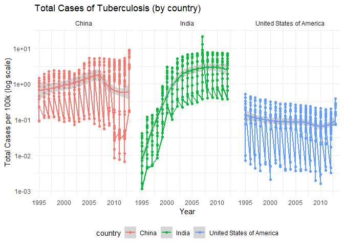
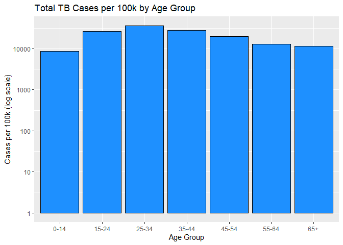
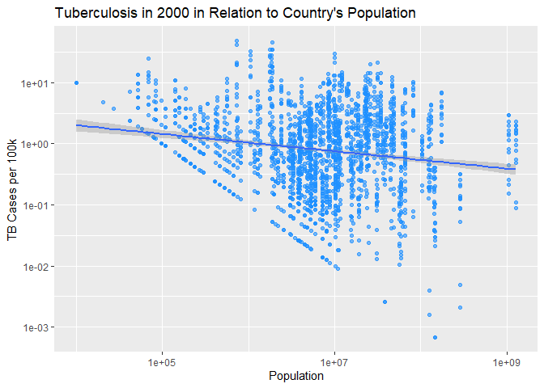

DSC1107_FA2
================
Rodillas, Christian Miguel T.
2025-02-16

\##1. Introduction

``` r
library(tidyverse)
```

    ## ── Attaching core tidyverse packages ──────────────────────── tidyverse 2.0.0 ──
    ## ✔ dplyr     1.1.4     ✔ readr     2.1.5
    ## ✔ forcats   1.0.0     ✔ stringr   1.5.1
    ## ✔ ggplot2   3.5.1     ✔ tibble    3.2.1
    ## ✔ lubridate 1.9.4     ✔ tidyr     1.3.1
    ## ✔ purrr     1.0.2     
    ## ── Conflicts ────────────────────────────────────────── tidyverse_conflicts() ──
    ## ✖ dplyr::filter() masks stats::filter()
    ## ✖ dplyr::lag()    masks stats::lag()
    ## ℹ Use the conflicted package (<http://conflicted.r-lib.org/>) to force all conflicts to become errors

``` r
population <- tidyr::who  
write_csv(who, "who.csv")
who <- read_tsv("who.tsv")
```

    ## Rows: 7240 Columns: 60
    ## ── Column specification ────────────────────────────────────────────────────────
    ## Delimiter: "\t"
    ## chr  (3): country, iso2, iso3
    ## dbl (57): year, new_sp_m014, new_sp_m1524, new_sp_m2534, new_sp_m3544, new_s...
    ## 
    ## ℹ Use `spec()` to retrieve the full column specification for this data.
    ## ℹ Specify the column types or set `show_col_types = FALSE` to quiet this message.

``` r
population <- tidyr::population  
write_csv(population, "population.csv")
population <- read_csv("population.csv")
```

    ## Rows: 4060 Columns: 3
    ## ── Column specification ────────────────────────────────────────────────────────
    ## Delimiter: ","
    ## chr (1): country
    ## dbl (2): year, population
    ## 
    ## ℹ Use `spec()` to retrieve the full column specification for this data.
    ## ℹ Specify the column types or set `show_col_types = FALSE` to quiet this message.

\##2. Import

``` r
cat(paste("The WHO dataset has", nrow(who), " number of rows and ",ncol(who)," number of columns. On the other hand,  the population dataset has", nrow(population), " number of rows and ",ncol(population)," column."))
```

    ## The WHO dataset has 7240  number of rows and  60  number of columns. On the other hand,  the population dataset has 4060  number of rows and  3  column.

For better visibility of their dimentsions, this is a table designed for
better visibility

``` r
library(tibble)


who_dimensions <- tibble(
  Dataset = "who",
  Rows = nrow(who),
  Columns = ncol(who)
)


population_dimensions <- tibble(
  Dataset = "Population",
  Rows = nrow(population),
  Columns = ncol(population)
)

dimensions_table <- bind_rows(who_dimensions, population_dimensions)
print(dimensions_table)
```

    ## # A tibble: 2 × 3
    ##   Dataset     Rows Columns
    ##   <chr>      <int>   <int>
    ## 1 who         7240      60
    ## 2 Population  4060       3

\##3. Tidy Data

``` r
print(population)
```

    ## # A tibble: 4,060 × 3
    ##    country      year population
    ##    <chr>       <dbl>      <dbl>
    ##  1 Afghanistan  1995   17586073
    ##  2 Afghanistan  1996   18415307
    ##  3 Afghanistan  1997   19021226
    ##  4 Afghanistan  1998   19496836
    ##  5 Afghanistan  1999   19987071
    ##  6 Afghanistan  2000   20595360
    ##  7 Afghanistan  2001   21347782
    ##  8 Afghanistan  2002   22202806
    ##  9 Afghanistan  2003   23116142
    ## 10 Afghanistan  2004   24018682
    ## # ℹ 4,050 more rows

``` r
summary(population)
```

    ##    country               year        population       
    ##  Length:4060        Min.   :1995   Min.   :1.129e+03  
    ##  Class :character   1st Qu.:1999   1st Qu.:6.029e+05  
    ##  Mode  :character   Median :2004   Median :5.319e+06  
    ##                     Mean   :2004   Mean   :3.003e+07  
    ##                     3rd Qu.:2009   3rd Qu.:1.855e+07  
    ##                     Max.   :2013   Max.   :1.386e+09

``` r
population2 <- population %>% 
  distinct() %>% 
  drop_na(population)
population2
```

    ## # A tibble: 4,060 × 3
    ##    country      year population
    ##    <chr>       <dbl>      <dbl>
    ##  1 Afghanistan  1995   17586073
    ##  2 Afghanistan  1996   18415307
    ##  3 Afghanistan  1997   19021226
    ##  4 Afghanistan  1998   19496836
    ##  5 Afghanistan  1999   19987071
    ##  6 Afghanistan  2000   20595360
    ##  7 Afghanistan  2001   21347782
    ##  8 Afghanistan  2002   22202806
    ##  9 Afghanistan  2003   23116142
    ## 10 Afghanistan  2004   24018682
    ## # ℹ 4,050 more rows

``` r
glimpse(who) 
```

    ## Rows: 7,240
    ## Columns: 60
    ## $ country      <chr> "Afghanistan", "Afghanistan", "Afghanistan", "Afghanistan…
    ## $ iso2         <chr> "AF", "AF", "AF", "AF", "AF", "AF", "AF", "AF", "AF", "AF…
    ## $ iso3         <chr> "AFG", "AFG", "AFG", "AFG", "AFG", "AFG", "AFG", "AFG", "…
    ## $ year         <dbl> 1980, 1981, 1982, 1983, 1984, 1985, 1986, 1987, 1988, 198…
    ## $ new_sp_m014  <dbl> NA, NA, NA, NA, NA, NA, NA, NA, NA, NA, NA, NA, NA, NA, N…
    ## $ new_sp_m1524 <dbl> NA, NA, NA, NA, NA, NA, NA, NA, NA, NA, NA, NA, NA, NA, N…
    ## $ new_sp_m2534 <dbl> NA, NA, NA, NA, NA, NA, NA, NA, NA, NA, NA, NA, NA, NA, N…
    ## $ new_sp_m3544 <dbl> NA, NA, NA, NA, NA, NA, NA, NA, NA, NA, NA, NA, NA, NA, N…
    ## $ new_sp_m4554 <dbl> NA, NA, NA, NA, NA, NA, NA, NA, NA, NA, NA, NA, NA, NA, N…
    ## $ new_sp_m5564 <dbl> NA, NA, NA, NA, NA, NA, NA, NA, NA, NA, NA, NA, NA, NA, N…
    ## $ new_sp_m65   <dbl> NA, NA, NA, NA, NA, NA, NA, NA, NA, NA, NA, NA, NA, NA, N…
    ## $ new_sp_f014  <dbl> NA, NA, NA, NA, NA, NA, NA, NA, NA, NA, NA, NA, NA, NA, N…
    ## $ new_sp_f1524 <dbl> NA, NA, NA, NA, NA, NA, NA, NA, NA, NA, NA, NA, NA, NA, N…
    ## $ new_sp_f2534 <dbl> NA, NA, NA, NA, NA, NA, NA, NA, NA, NA, NA, NA, NA, NA, N…
    ## $ new_sp_f3544 <dbl> NA, NA, NA, NA, NA, NA, NA, NA, NA, NA, NA, NA, NA, NA, N…
    ## $ new_sp_f4554 <dbl> NA, NA, NA, NA, NA, NA, NA, NA, NA, NA, NA, NA, NA, NA, N…
    ## $ new_sp_f5564 <dbl> NA, NA, NA, NA, NA, NA, NA, NA, NA, NA, NA, NA, NA, NA, N…
    ## $ new_sp_f65   <dbl> NA, NA, NA, NA, NA, NA, NA, NA, NA, NA, NA, NA, NA, NA, N…
    ## $ new_sn_m014  <dbl> NA, NA, NA, NA, NA, NA, NA, NA, NA, NA, NA, NA, NA, NA, N…
    ## $ new_sn_m1524 <dbl> NA, NA, NA, NA, NA, NA, NA, NA, NA, NA, NA, NA, NA, NA, N…
    ## $ new_sn_m2534 <dbl> NA, NA, NA, NA, NA, NA, NA, NA, NA, NA, NA, NA, NA, NA, N…
    ## $ new_sn_m3544 <dbl> NA, NA, NA, NA, NA, NA, NA, NA, NA, NA, NA, NA, NA, NA, N…
    ## $ new_sn_m4554 <dbl> NA, NA, NA, NA, NA, NA, NA, NA, NA, NA, NA, NA, NA, NA, N…
    ## $ new_sn_m5564 <dbl> NA, NA, NA, NA, NA, NA, NA, NA, NA, NA, NA, NA, NA, NA, N…
    ## $ new_sn_m65   <dbl> NA, NA, NA, NA, NA, NA, NA, NA, NA, NA, NA, NA, NA, NA, N…
    ## $ new_sn_f014  <dbl> NA, NA, NA, NA, NA, NA, NA, NA, NA, NA, NA, NA, NA, NA, N…
    ## $ new_sn_f1524 <dbl> NA, NA, NA, NA, NA, NA, NA, NA, NA, NA, NA, NA, NA, NA, N…
    ## $ new_sn_f2534 <dbl> NA, NA, NA, NA, NA, NA, NA, NA, NA, NA, NA, NA, NA, NA, N…
    ## $ new_sn_f3544 <dbl> NA, NA, NA, NA, NA, NA, NA, NA, NA, NA, NA, NA, NA, NA, N…
    ## $ new_sn_f4554 <dbl> NA, NA, NA, NA, NA, NA, NA, NA, NA, NA, NA, NA, NA, NA, N…
    ## $ new_sn_f5564 <dbl> NA, NA, NA, NA, NA, NA, NA, NA, NA, NA, NA, NA, NA, NA, N…
    ## $ new_sn_f65   <dbl> NA, NA, NA, NA, NA, NA, NA, NA, NA, NA, NA, NA, NA, NA, N…
    ## $ new_ep_m014  <dbl> NA, NA, NA, NA, NA, NA, NA, NA, NA, NA, NA, NA, NA, NA, N…
    ## $ new_ep_m1524 <dbl> NA, NA, NA, NA, NA, NA, NA, NA, NA, NA, NA, NA, NA, NA, N…
    ## $ new_ep_m2534 <dbl> NA, NA, NA, NA, NA, NA, NA, NA, NA, NA, NA, NA, NA, NA, N…
    ## $ new_ep_m3544 <dbl> NA, NA, NA, NA, NA, NA, NA, NA, NA, NA, NA, NA, NA, NA, N…
    ## $ new_ep_m4554 <dbl> NA, NA, NA, NA, NA, NA, NA, NA, NA, NA, NA, NA, NA, NA, N…
    ## $ new_ep_m5564 <dbl> NA, NA, NA, NA, NA, NA, NA, NA, NA, NA, NA, NA, NA, NA, N…
    ## $ new_ep_m65   <dbl> NA, NA, NA, NA, NA, NA, NA, NA, NA, NA, NA, NA, NA, NA, N…
    ## $ new_ep_f014  <dbl> NA, NA, NA, NA, NA, NA, NA, NA, NA, NA, NA, NA, NA, NA, N…
    ## $ new_ep_f1524 <dbl> NA, NA, NA, NA, NA, NA, NA, NA, NA, NA, NA, NA, NA, NA, N…
    ## $ new_ep_f2534 <dbl> NA, NA, NA, NA, NA, NA, NA, NA, NA, NA, NA, NA, NA, NA, N…
    ## $ new_ep_f3544 <dbl> NA, NA, NA, NA, NA, NA, NA, NA, NA, NA, NA, NA, NA, NA, N…
    ## $ new_ep_f4554 <dbl> NA, NA, NA, NA, NA, NA, NA, NA, NA, NA, NA, NA, NA, NA, N…
    ## $ new_ep_f5564 <dbl> NA, NA, NA, NA, NA, NA, NA, NA, NA, NA, NA, NA, NA, NA, N…
    ## $ new_ep_f65   <dbl> NA, NA, NA, NA, NA, NA, NA, NA, NA, NA, NA, NA, NA, NA, N…
    ## $ newrel_m014  <dbl> NA, NA, NA, NA, NA, NA, NA, NA, NA, NA, NA, NA, NA, NA, N…
    ## $ newrel_m1524 <dbl> NA, NA, NA, NA, NA, NA, NA, NA, NA, NA, NA, NA, NA, NA, N…
    ## $ newrel_m2534 <dbl> NA, NA, NA, NA, NA, NA, NA, NA, NA, NA, NA, NA, NA, NA, N…
    ## $ newrel_m3544 <dbl> NA, NA, NA, NA, NA, NA, NA, NA, NA, NA, NA, NA, NA, NA, N…
    ## $ newrel_m4554 <dbl> NA, NA, NA, NA, NA, NA, NA, NA, NA, NA, NA, NA, NA, NA, N…
    ## $ newrel_m5564 <dbl> NA, NA, NA, NA, NA, NA, NA, NA, NA, NA, NA, NA, NA, NA, N…
    ## $ newrel_m65   <dbl> NA, NA, NA, NA, NA, NA, NA, NA, NA, NA, NA, NA, NA, NA, N…
    ## $ newrel_f014  <dbl> NA, NA, NA, NA, NA, NA, NA, NA, NA, NA, NA, NA, NA, NA, N…
    ## $ newrel_f1524 <dbl> NA, NA, NA, NA, NA, NA, NA, NA, NA, NA, NA, NA, NA, NA, N…
    ## $ newrel_f2534 <dbl> NA, NA, NA, NA, NA, NA, NA, NA, NA, NA, NA, NA, NA, NA, N…
    ## $ newrel_f3544 <dbl> NA, NA, NA, NA, NA, NA, NA, NA, NA, NA, NA, NA, NA, NA, N…
    ## $ newrel_f4554 <dbl> NA, NA, NA, NA, NA, NA, NA, NA, NA, NA, NA, NA, NA, NA, N…
    ## $ newrel_f5564 <dbl> NA, NA, NA, NA, NA, NA, NA, NA, NA, NA, NA, NA, NA, NA, N…
    ## $ newrel_f65   <dbl> NA, NA, NA, NA, NA, NA, NA, NA, NA, NA, NA, NA, NA, NA, N…

``` r
who2 <- who %>%
  pivot_longer(
    cols = starts_with("new"), 
    names_to = "key",      
    values_to = "cases",       
    values_drop_na = TRUE      
  )

print(who2)
```

    ## # A tibble: 76,046 × 6
    ##    country     iso2  iso3   year key          cases
    ##    <chr>       <chr> <chr> <dbl> <chr>        <dbl>
    ##  1 Afghanistan AF    AFG    1997 new_sp_m014      0
    ##  2 Afghanistan AF    AFG    1997 new_sp_m1524    10
    ##  3 Afghanistan AF    AFG    1997 new_sp_m2534     6
    ##  4 Afghanistan AF    AFG    1997 new_sp_m3544     3
    ##  5 Afghanistan AF    AFG    1997 new_sp_m4554     5
    ##  6 Afghanistan AF    AFG    1997 new_sp_m5564     2
    ##  7 Afghanistan AF    AFG    1997 new_sp_m65       0
    ##  8 Afghanistan AF    AFG    1997 new_sp_f014      5
    ##  9 Afghanistan AF    AFG    1997 new_sp_f1524    38
    ## 10 Afghanistan AF    AFG    1997 new_sp_f2534    36
    ## # ℹ 76,036 more rows

``` r
library(tidyverse)

who3 <- who2 %>%
  mutate(
    key = str_replace(key, "newrel", "new_rel")  
  ) %>%
  separate(key, into = c("new", "type", "sex_age"), sep = "_", extra = "merge") %>%
  select(-new) 
print(who3)
```

    ## # A tibble: 76,046 × 7
    ##    country     iso2  iso3   year type  sex_age cases
    ##    <chr>       <chr> <chr> <dbl> <chr> <chr>   <dbl>
    ##  1 Afghanistan AF    AFG    1997 sp    m014        0
    ##  2 Afghanistan AF    AFG    1997 sp    m1524      10
    ##  3 Afghanistan AF    AFG    1997 sp    m2534       6
    ##  4 Afghanistan AF    AFG    1997 sp    m3544       3
    ##  5 Afghanistan AF    AFG    1997 sp    m4554       5
    ##  6 Afghanistan AF    AFG    1997 sp    m5564       2
    ##  7 Afghanistan AF    AFG    1997 sp    m65         0
    ##  8 Afghanistan AF    AFG    1997 sp    f014        5
    ##  9 Afghanistan AF    AFG    1997 sp    f1524      38
    ## 10 Afghanistan AF    AFG    1997 sp    f2534      36
    ## # ℹ 76,036 more rows

``` r
who_tidy <- who3 %>%
  mutate(
    sex = str_extract(sex_age, "^[mf]"),  
    age_group = str_replace(sex_age, "^[mf]", ""),  
    age_group = case_when(
      age_group == "65" ~ "65+",  
      TRUE ~ str_replace(age_group, "(\\d{2})$", "-\\1") 
    )
  ) %>%
  select(-sex_age)  

print(who_tidy)
```

    ## # A tibble: 76,046 × 8
    ##    country     iso2  iso3   year type  cases sex   age_group
    ##    <chr>       <chr> <chr> <dbl> <chr> <dbl> <chr> <chr>    
    ##  1 Afghanistan AF    AFG    1997 sp        0 m     0-14     
    ##  2 Afghanistan AF    AFG    1997 sp       10 m     15-24    
    ##  3 Afghanistan AF    AFG    1997 sp        6 m     25-34    
    ##  4 Afghanistan AF    AFG    1997 sp        3 m     35-44    
    ##  5 Afghanistan AF    AFG    1997 sp        5 m     45-54    
    ##  6 Afghanistan AF    AFG    1997 sp        2 m     55-64    
    ##  7 Afghanistan AF    AFG    1997 sp        0 m     65+      
    ##  8 Afghanistan AF    AFG    1997 sp        5 f     0-14     
    ##  9 Afghanistan AF    AFG    1997 sp       38 f     15-24    
    ## 10 Afghanistan AF    AFG    1997 sp       36 f     25-34    
    ## # ℹ 76,036 more rows

``` r
glimpse(population2) 
```

    ## Rows: 4,060
    ## Columns: 3
    ## $ country    <chr> "Afghanistan", "Afghanistan", "Afghanistan", "Afghanistan",…
    ## $ year       <dbl> 1995, 1996, 1997, 1998, 1999, 2000, 2001, 2002, 2003, 2004,…
    ## $ population <dbl> 17586073, 18415307, 19021226, 19496836, 19987071, 20595360,…

Since the population2 is already on a long format, we can just utilize
the original population2 for tidying.

``` r
population3 <- population2
population_tidy <- population3 %>%
  mutate(population = as.integer(population), year = as.integer(year))

print(population_tidy)
```

    ## # A tibble: 4,060 × 3
    ##    country      year population
    ##    <chr>       <int>      <int>
    ##  1 Afghanistan  1995   17586073
    ##  2 Afghanistan  1996   18415307
    ##  3 Afghanistan  1997   19021226
    ##  4 Afghanistan  1998   19496836
    ##  5 Afghanistan  1999   19987071
    ##  6 Afghanistan  2000   20595360
    ##  7 Afghanistan  2001   21347782
    ##  8 Afghanistan  2002   22202806
    ##  9 Afghanistan  2003   23116142
    ## 10 Afghanistan  2004   24018682
    ## # ℹ 4,050 more rows

Since both year and population could not have a floating number or a
decimal, it is appropriate to change and store both datatype as integer
to prevent any problems in analysis.

``` r
tuberculosis <- who_tidy %>%
  left_join(population_tidy, by = c("country", "year"))

print(tuberculosis)
```

    ## # A tibble: 76,046 × 9
    ##    country     iso2  iso3   year type  cases sex   age_group population
    ##    <chr>       <chr> <chr> <dbl> <chr> <dbl> <chr> <chr>          <int>
    ##  1 Afghanistan AF    AFG    1997 sp        0 m     0-14        19021226
    ##  2 Afghanistan AF    AFG    1997 sp       10 m     15-24       19021226
    ##  3 Afghanistan AF    AFG    1997 sp        6 m     25-34       19021226
    ##  4 Afghanistan AF    AFG    1997 sp        3 m     35-44       19021226
    ##  5 Afghanistan AF    AFG    1997 sp        5 m     45-54       19021226
    ##  6 Afghanistan AF    AFG    1997 sp        2 m     55-64       19021226
    ##  7 Afghanistan AF    AFG    1997 sp        0 m     65+         19021226
    ##  8 Afghanistan AF    AFG    1997 sp        5 f     0-14        19021226
    ##  9 Afghanistan AF    AFG    1997 sp       38 f     15-24       19021226
    ## 10 Afghanistan AF    AFG    1997 sp       36 f     25-34       19021226
    ## # ℹ 76,036 more rows

``` r
tuberculosis <- tuberculosis %>%
  select(-iso2, -iso3 )%>%
  drop_na()

print(tuberculosis)
```

    ## # A tibble: 75,234 × 7
    ##    country      year type  cases sex   age_group population
    ##    <chr>       <dbl> <chr> <dbl> <chr> <chr>          <int>
    ##  1 Afghanistan  1997 sp        0 m     0-14        19021226
    ##  2 Afghanistan  1997 sp       10 m     15-24       19021226
    ##  3 Afghanistan  1997 sp        6 m     25-34       19021226
    ##  4 Afghanistan  1997 sp        3 m     35-44       19021226
    ##  5 Afghanistan  1997 sp        5 m     45-54       19021226
    ##  6 Afghanistan  1997 sp        2 m     55-64       19021226
    ##  7 Afghanistan  1997 sp        0 m     65+         19021226
    ##  8 Afghanistan  1997 sp        5 f     0-14        19021226
    ##  9 Afghanistan  1997 sp       38 f     15-24       19021226
    ## 10 Afghanistan  1997 sp       36 f     25-34       19021226
    ## # ℹ 75,224 more rows

\##4. Data Manipulation

``` r
library(dplyr)

us_tb_cases <- tuberculosis %>%
  filter(country == "United States of America", year >= 2000) %>%
  group_by(sex) %>%
  summarise(total_cases = sum(cases, na.rm = TRUE)) %>%
  bind_rows(summarise(., sex = "All Genders", total_cases = sum(total_cases)))

print(us_tb_cases)
```

    ## # A tibble: 3 × 2
    ##   sex         total_cases
    ##   <chr>             <dbl>
    ## 1 f                 45768
    ## 2 m                 77867
    ## 3 All Genders      123635

According to the table above, the total number of tuberculosis cases is
at 123635, and the number is dominated mostly by **Male**, at **77,867
reported cases**.

``` r
tuberculosis_cases <- tuberculosis %>%
  mutate(cases_per_100k = (cases / population) * 100000)

highest <- tuberculosis_cases %>%
  filter(!is.na(cases_per_100k)) %>%
  arrange(desc(cases_per_100k)) %>%
  slice(1) %>%
  select(country, year, cases_per_100k)

print(highest)
```

    ## # A tibble: 1 × 3
    ##   country  year cases_per_100k
    ##   <chr>   <dbl>          <dbl>
    ## 1 Samoa    2009           602.

The country with the highest cases recorded for TB is **Samoa during the
year 2009**, with a record **601.5 cases** per 100k people.

``` r
lowest <- tuberculosis_cases %>%
  filter(!is.na(cases_per_100k) & cases_per_100k > 0) %>% 
  arrange(cases_per_100k) %>%
  slice(1) %>%
  select(country, year, cases_per_100k)
print(lowest)
```

    ## # A tibble: 1 × 3
    ##   country             year cases_per_100k
    ##   <chr>              <dbl>          <dbl>
    ## 1 Russian Federation  2000       0.000681

On the otherhand, not taking into account the zero cases, the **Russian
Federation had the lowest number of cases during the year 2000**, which
suggests that there is only **0.0006% per 100,000 people** in population
have TB.

\##5. Data Visualization

``` r
library(ggplot2)
tuberculosis <- tuberculosis %>%
  mutate(cases_per_100k = (cases / population) * 100000)

countries <- tuberculosis %>%
  filter(country %in% c("India", "China", "United States of America"))

ggplot(countries, aes(x = year, y = cases_per_100k, color = country)) +
  geom_line(size = 1) +
  geom_point() +
  geom_smooth( method ="loess") +
  scale_y_log10() +
  facet_wrap(~ country) + 
  labs(
    title = "Total Cases of Tuberculosis (by country)",
    x = "Year",
    y = "Total Cases per 100k (log scale)"
  ) +
  theme_minimal() +
  theme(legend.position = "bottom")
```

    ## Warning: Using `size` aesthetic for lines was deprecated in ggplot2 3.4.0.
    ## ℹ Please use `linewidth` instead.
    ## This warning is displayed once every 8 hours.
    ## Call `lifecycle::last_lifecycle_warnings()` to see where this warning was
    ## generated.

    ## `geom_smooth()` using formula = 'y ~ x'

<!-- -->

The series of line graphs visualizes the trend in Tuberculosis cases per
100,000 individuals for a span from 1997-2008 on three countries, namely
China, India, and the United States of America. Based on the graph, the
**USA**, which peeks at around 0.3 shows a **gradual sign of improvement
and a better countermeasure**, up until the later years, on TB against
large countries of China and India. On the otherhand, the country of
**India**, which has started relatively low, has **progressively risen
up in numbers**, peaking at around 13 cases per 100k people in the 21st
century, and has not been address ever since. Much like the US, has been
consistent playing at around 2-5 cases per 100k, only peaking at the
recent years. By inspecting the graphs, it could be seen that TB has
primary addressed throughout the 2000s up until 2008, only rising up in
the recent years where TB has skyrocketed, which may be caused by
different other factors. The spikes are a good basis of these countries
trying to constantly address the risky situations of Tuberculosis.

``` r
tuberculosis_cases <- tuberculosis_cases %>%
  mutate(cases_per_100k = (cases / population) * 100000)

age_group_distribution <- tuberculosis_cases %>%
  group_by(age_group) %>%
  summarise(total_cases_per_100k = sum(cases_per_100k, na.rm = TRUE))

ggplot(age_group_distribution, aes(x = age_group, y = total_cases_per_100k)) +
  geom_bar(stat = "identity", color = "black", fill = "dodgerblue") +
  scale_y_log10() + 
  labs(title = "Total TB Cases per 100k by Age Group",
       x = "Age Group",
       y = "Cases per 100k (log scale)")
```

<!-- -->

The graph above shows the total Tuberculosis cases per age group
althroughout the year analyzed. According to the graph, **TB cases are
primarily accumulated by the working group**, where most cases at around
15000 led by ages 25-34 and 35-44 respectively. Closely following, the
cases for the young adults are also in risky area as it ranges at around
the same range that of its older counterpart. Based on the graph, it is
on the steady decrease as people get older, which may indicate that one
of the most common variable of acquiring Tuberculosis is through
constant interaction at work, with other people.

``` r
cases_100k_2000 <- tuberculosis %>%
  filter(year == 2000) %>%
  filter(population > 0, cases_per_100k > 0) 

ggplot(cases_100k_2000, aes(x = population, y = cases_per_100k)) +
  geom_point(alpha = 0.6, color = "dodgerblue") +  
  geom_smooth(method = "lm") + 
  scale_x_log10() +  
  scale_y_log10() + 
  labs(
    title = "Tuberculosis in 2000 in Relation to Country's Population ",
    x = "Population",
    y = "TB Cases per 100k"
  )
```

    ## `geom_smooth()` using formula = 'y ~ x'

<!-- -->

The graph above primarily shows the relationship of the Tuberculosis
cases in regards to the countries’ population per 100,000 people at the
year 2000. As evident in the graph, there is an evident downtrend, where
**lower counts of population may be seen with a higher TB cases rate**.
The graph could suggest a **inverse proportion**. It could be a factor
of smaller country having a lower GDP or economic standpoint that lowers
their country’s capability to address such large disease such as TB.
With limited healthcare, smaller countries are more susceptible to
diseases that easily spread from person to person. Unlike larger
countries, who may have the capability to address such problems.
