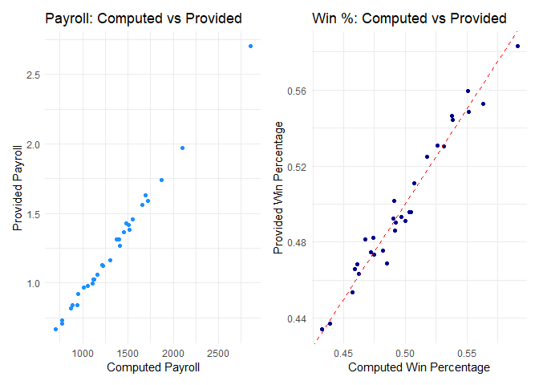
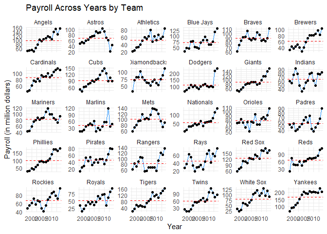
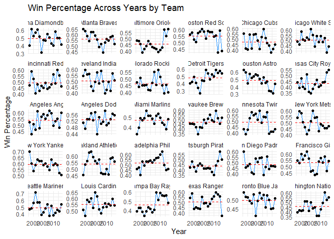
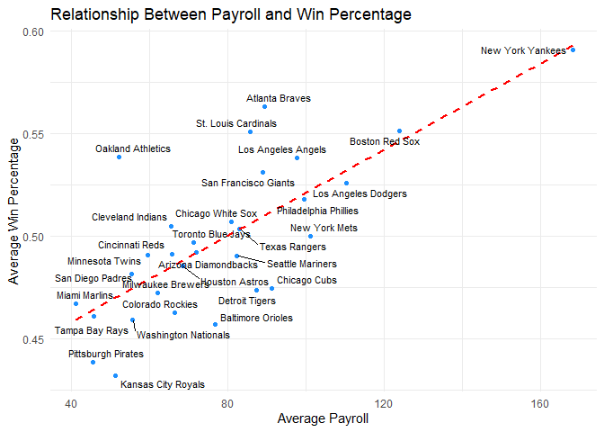

DSC1107_FA3_Rodillas
================
Rodillas
2025-02-23

# 1. Wrangle

## 1.1 Import

``` r
library(tidyverse)
```

    ## ── Attaching core tidyverse packages ──────────────────────── tidyverse 2.0.0 ──
    ## ✔ dplyr     1.1.4     ✔ readr     2.1.5
    ## ✔ forcats   1.0.0     ✔ stringr   1.5.1
    ## ✔ ggplot2   3.5.1     ✔ tibble    3.2.1
    ## ✔ lubridate 1.9.4     ✔ tidyr     1.3.1
    ## ✔ purrr     1.0.2     
    ## ── Conflicts ────────────────────────────────────────── tidyverse_conflicts() ──
    ## ✖ dplyr::filter() masks stats::filter()
    ## ✖ dplyr::lag()    masks stats::lag()
    ## ℹ Use the conflicted package (<http://conflicted.r-lib.org/>) to force all conflicts to become errors

``` r
library(tidyr)
library(ggrepel)
library(kableExtra)
```

    ## 
    ## Attaching package: 'kableExtra'
    ## 
    ## The following object is masked from 'package:dplyr':
    ## 
    ##     group_rows

``` r
library(cowplot)
```

    ## 
    ## Attaching package: 'cowplot'
    ## 
    ## The following object is masked from 'package:lubridate':
    ## 
    ##     stamp

``` r
library(patchwork)
```

    ## 
    ## Attaching package: 'patchwork'
    ## 
    ## The following object is masked from 'package:cowplot':
    ## 
    ##     align_plots

``` r
load("E:/Downloads/ml_pay.rdata")
ml_raw <- as_tibble(ml_pay)
```

The ml_pay data is a data representation of team pay and salary for the
Major League Baseball which consists of 30 rows, and 54 columns (which
are the variables). After transforming the data to a tibble, it could be
observed that the data corresponds with the aforementioned description.
Upon analysing, the data have variables for payroll, avgwin, the team
names during the 2014 season, as well as payroll for each team from 1998
to 2014 season, and also total number of wins and percentage during the
same stretch of seasons.

## 1.2 Tidy

``` r
library(tidyverse)

ml_aggregate <- ml_pay %>%
  rename(team = Team.name.2014,
         payroll_aggregate = payroll,
         pct_wins_aggregate = avgwin) %>%
  select(team, payroll_aggregate, pct_wins_aggregate)

ml_pay_yearly <- ml_pay %>%
  rename(team = Team.name.2014) %>%
  select(team, starts_with("p")) %>%
  select(-payroll) %>% 
  pivot_longer(
    cols = starts_with("p"),
    names_to = "year",
    names_prefix = "p",
    values_to = "payroll"
  )

ml_wins_yearly <- ml_pay %>%
  rename(team = Team.name.2014) %>%
  select(team, matches("^X\\d{4}$")) %>%
  pivot_longer(
    cols = -team,
    names_to = "year",
    names_prefix = "X",
    values_to = "num_wins"
  )

ml_wins_perc <- ml_pay %>%
  rename(team = Team.name.2014) %>%
  select(team, matches("^X\\d{4}\\.pct$")) %>%
  pivot_longer(
    cols = -team,
    names_to = "year",
    names_prefix = "X",
    values_to = "pct_wins"
  ) %>%
  mutate(year = str_replace(year, "\\.pct$", ""))

ml_yearly <- ml_pay_yearly %>%
  left_join(ml_wins_yearly, by = c("team", "year")) %>%
  left_join(ml_wins_perc, by = c("team", "year")) %>%
  mutate(year = as.integer(year))

print(ml_aggregate)
```

    ##                     team payroll_aggregate pct_wins_aggregate
    ## 1   Arizona Diamondbacks         1.1208736          0.4902585
    ## 2         Atlanta Braves         1.3817118          0.5527605
    ## 3      Baltimore Orioles         1.1612117          0.4538250
    ## 4         Boston Red Sox         1.9723587          0.5487172
    ## 5           Chicago Cubs         1.4597668          0.4736557
    ## 6      Chicago White Sox         1.3153909          0.5111170
    ## 7        Cincinnati Reds         1.0247816          0.4861602
    ## 8      Cleveland Indians         0.9991810          0.4959225
    ## 9       Colorado Rockies         1.0261536          0.4633760
    ## 10        Detroit Tigers         1.4297408          0.4822029
    ## 11        Houston Astros         1.0601501          0.4687202
    ## 12    Kansas City Royals         0.8177417          0.4342288
    ## 13    Los Angeles Angels         1.5626224          0.5463819
    ## 14   Los Angeles Dodgers         1.7402719          0.5308482
    ## 15         Miami Marlins         0.6678019          0.4813631
    ## 16     Milwaukee Brewers         0.9790940          0.4746570
    ## 17       Minnesota Twins         0.9698272          0.5019047
    ## 18         New York Mets         1.5884288          0.4911388
    ## 19      New York Yankees         2.7032482          0.5830719
    ## 20     Oakland Athletics         0.8409340          0.5445067
    ## 21 Philadelphia Phillies         1.6301209          0.5247021
    ## 22    Pittsburgh Pirates         0.7339057          0.4371254
    ## 23      San Diego Padres         0.8406668          0.4754884
    ## 24  San Francisco Giants         1.4168770          0.5304369
    ## 25      Seattle Mariners         1.3111203          0.4925819
    ## 26   St. Louis Cardinals         1.3681117          0.5595414
    ## 27        Tampa Bay Rays         0.7107894          0.4685176
    ## 28         Texas Rangers         1.2693201          0.4956494
    ## 29     Toronto Blue Jays         1.1290219          0.4930823
    ## 30  Washington Nationals         0.9219641          0.4660195

``` r
print(ml_yearly)
```

    ## # A tibble: 510 × 5
    ##    team                  year payroll num_wins pct_wins
    ##    <fct>                <int>   <dbl>    <int>    <dbl>
    ##  1 Arizona Diamondbacks  1998    31.6       65    0.399
    ##  2 Arizona Diamondbacks  1999    70.5      100    0.613
    ##  3 Arizona Diamondbacks  2000    81.0       85    0.525
    ##  4 Arizona Diamondbacks  2001    81.2       92    0.568
    ##  5 Arizona Diamondbacks  2002   103.        98    0.605
    ##  6 Arizona Diamondbacks  2003    80.6       84    0.519
    ##  7 Arizona Diamondbacks  2004    70.2       51    0.315
    ##  8 Arizona Diamondbacks  2005    63.0       77    0.475
    ##  9 Arizona Diamondbacks  2006    59.7       76    0.469
    ## 10 Arizona Diamondbacks  2007    52.1       90    0.552
    ## # ℹ 500 more rows

Comparing the two tibbles, ml_aggregate has a more cleaner approach to
tidying the data with only a 30x3 dimension which data are separated
depending on the team. On the other hand, the ml_yearly has a whopping
510x5 tibble dimension since there are team duplicates each separated by
year. The good thing for yearly is it could pinpoint a specific year for
a more intricate data analysis.

## 1.3 Quality Control

``` r
ml_aggregate_computed <- ml_yearly %>%
  group_by(team) %>%
  summarise(
    payroll_aggregate_computed = sum(payroll, na.rm = TRUE), 
    pct_wins_aggregate_computed = mean(pct_wins, na.rm = TRUE) 
  )

ml_aggregate_joined <- ml_aggregate %>%
  left_join(ml_aggregate_computed, by = "team")

ml_aggregate_joined
```

    ##                     team payroll_aggregate pct_wins_aggregate
    ## 1   Arizona Diamondbacks         1.1208736          0.4902585
    ## 2         Atlanta Braves         1.3817118          0.5527605
    ## 3      Baltimore Orioles         1.1612117          0.4538250
    ## 4         Boston Red Sox         1.9723587          0.5487172
    ## 5           Chicago Cubs         1.4597668          0.4736557
    ## 6      Chicago White Sox         1.3153909          0.5111170
    ## 7        Cincinnati Reds         1.0247816          0.4861602
    ## 8      Cleveland Indians         0.9991810          0.4959225
    ## 9       Colorado Rockies         1.0261536          0.4633760
    ## 10        Detroit Tigers         1.4297408          0.4822029
    ## 11        Houston Astros         1.0601501          0.4687202
    ## 12    Kansas City Royals         0.8177417          0.4342288
    ## 13    Los Angeles Angels         1.5626224          0.5463819
    ## 14   Los Angeles Dodgers         1.7402719          0.5308482
    ## 15         Miami Marlins         0.6678019          0.4813631
    ## 16     Milwaukee Brewers         0.9790940          0.4746570
    ## 17       Minnesota Twins         0.9698272          0.5019047
    ## 18         New York Mets         1.5884288          0.4911388
    ## 19      New York Yankees         2.7032482          0.5830719
    ## 20     Oakland Athletics         0.8409340          0.5445067
    ## 21 Philadelphia Phillies         1.6301209          0.5247021
    ## 22    Pittsburgh Pirates         0.7339057          0.4371254
    ## 23      San Diego Padres         0.8406668          0.4754884
    ## 24  San Francisco Giants         1.4168770          0.5304369
    ## 25      Seattle Mariners         1.3111203          0.4925819
    ## 26   St. Louis Cardinals         1.3681117          0.5595414
    ## 27        Tampa Bay Rays         0.7107894          0.4685176
    ## 28         Texas Rangers         1.2693201          0.4956494
    ## 29     Toronto Blue Jays         1.1290219          0.4930823
    ## 30  Washington Nationals         0.9219641          0.4660195
    ##    payroll_aggregate_computed pct_wins_aggregate_computed
    ## 1                   1222.9841                   0.4921264
    ## 2                   1518.3098                   0.5631539
    ## 3                   1305.2710                   0.4570920
    ## 4                   2103.5807                   0.5512860
    ## 5                   1551.7256                   0.4745898
    ## 6                   1375.1059                   0.5069221
    ## 7                   1118.7674                   0.4913973
    ## 8                   1113.1666                   0.5047025
    ## 9                   1129.3117                   0.4626324
    ## 10                  1483.9380                   0.4738311
    ## 11                  1162.7931                   0.4853919
    ## 12                   869.9087                   0.4322229
    ## 13                  1660.8796                   0.5380382
    ## 14                  1874.1943                   0.5261364
    ## 15                   698.0929                   0.4673161
    ## 16                  1053.9193                   0.4722253
    ## 17                  1010.6997                   0.4908542
    ## 18                  1718.5959                   0.5001207
    ## 19                  2857.0926                   0.5909819
    ## 20                   887.5729                   0.5385489
    ## 21                  1689.3115                   0.5178263
    ## 22                   771.7683                   0.4387483
    ## 23                   939.5651                   0.4816201
    ## 24                  1511.3513                   0.5311866
    ## 25                  1399.2147                   0.4905675
    ## 26                  1458.3757                   0.5507321
    ## 27                   776.1869                   0.4610341
    ## 28                  1411.4163                   0.5033788
    ## 29                  1211.6357                   0.4971440
    ## 30                   946.6941                   0.4591908

``` r
p1 <- ggplot(ml_aggregate_joined, aes(x = payroll_aggregate_computed, y = payroll_aggregate)) +
  geom_point(color = "dodgerblue") +
  geom_abline(slope = 1, intercept = 0, linetype = "dashed", color = "red") +  
  labs(title = "Payroll: Computed vs Provided",
       x = "Computed Payroll",
       y = "Provided Payroll") +
  theme_minimal()

p2 <- ggplot(ml_aggregate_joined, aes(x = pct_wins_aggregate_computed, y = pct_wins_aggregate)) +
  geom_point(color = "darkblue") +
  geom_abline(slope = 1, intercept = 0, linetype = "dashed", color = "red") + 
  labs(title = "Win %: Computed vs Provided",
       x = "Computed Win Percentage",
       y = "Provided Win Percentage") +
  theme_minimal()
p1 + p2
```

<!-- -->

Looking at the spread of the data, it shows that the two data, the
computed and the provided, apart from the values of x and y, as well as
minimal data, are strikingly similar to each other, showing no
significant errors.

# Explore

## 2.1 Payroll Across Years

``` r
ml_yearly <- ml_yearly %>%
  mutate(team_plot = case_when(
    team %in% c("Chicago White Sox", "Boston Red Sox", "Toronto Blue Jays") ~ word(team, 2, 3),  
    str_count(team, "\\s") == 2 ~ word(team, -1),  
    str_count(team, "\\s") == 1 ~ word(team, -1), 
    TRUE ~ team  
  ))

ml_team_avg_payroll <- ml_yearly %>%
  group_by(team) %>%
  summarise(avg_payroll = mean(payroll, na.rm = TRUE))

ml_yearly <- ml_yearly %>%
  left_join(ml_team_avg_payroll, by = "team")

ggplot(ml_yearly, aes(x = year, y = payroll, group = team)) +
  geom_line(color = "dodgerblue") +
  geom_point() +
  geom_hline(aes(yintercept = avg_payroll), linetype = "dashed", color = "red") +
  facet_wrap(~team_plot, scales = "free_y") + 
  labs(title = "Payroll Across Years by Team",
       x = "Year",
       y = "Payroll (in million dollars)") +
  theme_minimal()
```

<!-- -->

The set of figures above displays the rise and fall of the payroll
across the years. Looking at most of the graph, there has been a common
denominator among the teams, that are most of them starts the payroll on
a low average and gradually increase as years went by. There may have
different factors that affects these changes. First is the growth of the
sport of ml as a whole, the budget of each teams gradually increase as
deals and endorsements allows the team to pay higher salaries.

``` r
top_teams_payroll <- ml_yearly %>%
  group_by(team) %>%
  summarise(payroll_aggregate_computed = sum(payroll, na.rm = TRUE)) %>%
  arrange(desc(payroll_aggregate_computed)) %>%
  slice_head(n = 3)

print(top_teams_payroll)
```

    ## # A tibble: 3 × 2
    ##   team                payroll_aggregate_computed
    ##   <fct>                                    <dbl>
    ## 1 New York Yankees                         2857.
    ## 2 Boston Red Sox                           2104.
    ## 3 Los Angeles Dodgers                      1874.

``` r
payroll_change <- ml_yearly %>%
  filter(year %in% c(1998, 2014)) %>%
  select(team, year, payroll) %>%
  pivot_wider(names_from = year, values_from = payroll, names_prefix = "payroll_") %>%
  mutate(pct_increase = (payroll_2014 - payroll_1998) / payroll_1998 * 100) %>%
  arrange(desc(pct_increase)) %>%
  slice_head(n = 3)

print(payroll_change)
```

    ## # A tibble: 3 × 4
    ##   team                  payroll_1998 payroll_2014 pct_increase
    ##   <fct>                        <dbl>        <dbl>        <dbl>
    ## 1 Washington Nationals          8.32         135.        1520.
    ## 2 Detroit Tigers               19.2          162.         743.
    ## 3 Philadelphia Phillies        28.6          180.         529.

The metrics payroll_aggregate_computed and pct_increase reflects the set
of plots above as it shows the specific numerical data of each payroll
of the team. the Payroll Aggregate shows the total amount of money teams
have paid to their players. As observed, high market teams such as New
York Yankees, Boston Red Sox, and Los Angeles Dodgers tend to have more
money to pay off their players as shown in the data above.

On the other hand, the increase shows the growth of each payroll during
the time period. Similar to the graphs, the increase of each payroll
shows the steepness of each lines on the plot. According to the data,
the Washington Nationals have the largest exponential growth among all
teams, rising in payroll increase as their initial value are relatively
low.

## 2.2 Win percentage across years

``` r
library(dplyr)
library(stringr)

ml_yearly <- ml_yearly %>%
  mutate(team_plot = case_when(
    team %in% c("Chicago White Sox", "Boston Red Sox", "Toronto Blue Jays") ~ word(team, 2, 3),  
    str_count(team, "\\s") == 2 ~ word(team, 3, 3),  
    str_count(team, "\\s") == 1 ~ word(team, 2, 2),  
    TRUE ~ team 
  ))
ml_team_avg <- ml_yearly %>%
  group_by(team) %>%
  summarize(avg_pct_wins = mean(pct_wins, na.rm = TRUE))


ggplot(ml_yearly, aes(x = year, y = pct_wins, group = team)) +
  geom_line(color = "dodgerblue") +
  geom_point() +
  geom_hline(data = ml_team_avg, aes(yintercept = avg_pct_wins), 
             linetype = "dashed", color = "red") +
  facet_wrap(~team, scales = "free_y") +
  labs(title = "Win Percentage Across Years by Team",
       x = "Year",
       y = "Win Percentage") +
  theme_minimal()
```

<!-- -->

Similar to the payroll plots of each team in the previous number, the
series of plots visualizes the increase and decrease of win percentage
of teams across the years. Although have similarities, the difference of
the win percentage is that there is no observable gradual increase in
both teams, as win percentage are based off of the abilities of each
teams, not the growth of the sport itself.

``` r
top_teams_wins <- ml_yearly %>%
  group_by(team) %>%
  summarise(pct_wins_aggregate_computed = sum(pct_wins, na.rm = TRUE)) %>%
  arrange(desc(pct_wins_aggregate_computed)) %>%
  slice_head(n = 3)

print(top_teams_wins)
```

    ## # A tibble: 3 × 2
    ##   team             pct_wins_aggregate_computed
    ##   <fct>                                  <dbl>
    ## 1 New York Yankees                       10.0 
    ## 2 Atlanta Braves                          9.57
    ## 3 Boston Red Sox                          9.37

``` r
top_erratic_teams <- ml_yearly %>%
  group_by(team) %>%
  summarise(pct_wins_sd = sd(pct_wins, na.rm = TRUE)) %>%
  arrange(desc(pct_wins_sd)) %>%
  slice_head(n = 3) 

top_erratic_teams
```

    ## # A tibble: 3 × 2
    ##   team             pct_wins_sd
    ##   <fct>                  <dbl>
    ## 1 Houston Astros        0.0914
    ## 2 Detroit Tigers        0.0898
    ## 3 Seattle Mariners      0.0892

Similarly, the metrics of data above shows the numerical data of the
rise and changes of wins computed during the stretch of the seasons
given. The top teams shows the amount of total wins on the league.
Similar to the payroll, the wins aggregate computed is also led by the
big market New York Yankees, which have shown tremendous winning
capability over the course of the years given. This is also shown on the
above win percentage plot over time.

On the other hand, pct_wins_sd measures the variability of win
percentages, meaning it shows how erratic or up and down a team is.
Teams with higher standard deviation shows erracticness and
inconsistencies, failing to secure long tenured players to keep their
winning streak. It is shown in the above plot as the teams with the most
usual up and down lines. which can be seen in the varying steepness of
the lines on the plot.

## 2.3 Win percentage versus payroll

``` r
ml_aggregated <- ml_yearly %>%
  group_by(team) %>%
  summarize(
    avg_payroll = mean(payroll, na.rm = TRUE), 
    avg_pct_wins = mean(pct_wins, na.rm = TRUE)
  )

ggplot(ml_aggregated, aes(x = avg_payroll, y = avg_pct_wins, label = team)) +
  geom_point(color = "dodgerblue") + 
  geom_smooth(method = "lm", se = FALSE, color = "red", linetype = "dashed") + 
  geom_text_repel(size = 3) +  
  labs(
    title = "Relationship Between Payroll and Win Percentage",
    x = "Average Payroll",
    y = "Average Win Percentage"
  ) +
  theme_minimal()
```

    ## `geom_smooth()` using formula = 'y ~ x'

    ## Warning: The following aesthetics were dropped during statistical transformation: label.
    ## ℹ This can happen when ggplot fails to infer the correct grouping structure in
    ##   the data.
    ## ℹ Did you forget to specify a `group` aesthetic or to convert a numerical
    ##   variable into a factor?

<!-- -->

The above plot shows the relationship between the Average Win Percentage
of Each Teams to the Average Payroll. Evidently, it shows a positive
relationship between the two variables as most teams play around the red
dashed line. The trend shows that the higher the team’s avberage
payroll, the more likely they are to achieve a higher win percentage.
This results may be seen as expected as higher market value teams such
as the Yankeers and Red Sox, are among the mong “winningest” teams
throughout the years. Due to their high capability to pay, they are more
likely to sign high name players that could carry their franchises to
wins.

## 2.4 Team efficiency

``` r
ml_efficiency <- ml_yearly %>%
  group_by(team) %>%
  summarise(
    pct_wins_aggregate_computed = sum(pct_wins, na.rm = TRUE),
    payroll_aggregate_computed = sum(payroll, na.rm = TRUE),
    efficiency = pct_wins_aggregate_computed / payroll_aggregate_computed
  ) %>%
  arrange(desc(efficiency)) 

top_3_efficient_teams <- ml_efficiency %>%
  slice_head(n = 3)

print(top_3_efficient_teams)
```

    ## # A tibble: 3 × 4
    ##   team              pct_wins_aggregate_compu…¹ payroll_aggregate_co…² efficiency
    ##   <fct>                                  <dbl>                  <dbl>      <dbl>
    ## 1 Miami Marlins                           7.94                   698.     0.0114
    ## 2 Oakland Athletics                       9.16                   888.     0.0103
    ## 3 Tampa Bay Rays                          7.84                   776.     0.0101
    ## # ℹ abbreviated names: ¹​pct_wins_aggregate_computed,
    ## #   ²​payroll_aggregate_computed

The data above shows the team efficiency through the stretch of the
given year. Based on the data, their efficiency stems from their
capability to achieve a relatively high status as a franchise despite
having a lower budget. Their efficiency values, calculated as the ratio
of aggregate win percentage to aggregate payroll, indicate that they
maximize wins while spending less. Looking at the plot above, it could
be seen that most of these efficient teams are on the lower side of the
payroll, showing that they can relatively achieve higher status despite
the low payroll through the franchises’ ability to scout talent and
develop young players with lower pay. This aligns with real-world
observations, where teams like the Oakland Athletics, having a high pct
wins aggregate, are known for using data-driven strategies to build
strong rosters on a budget, a concept popularized by the “Moneyball”
approach.
