DSC1107_FA4_Rodillas
================
Rodillas
2025-03-07

# 1 Case study: Bone mineral density (30 points for correctness; 7 points for presentation)

## 1.1 Import (2 points)

1.  Using the readxl package, import the data into a tibble called
    bmd_raw.
2.  Print the imported tibble.

``` r
bmd_raw <- read_excel("E:/Downloads/bmd-data.xlsx")
bmd_raw
```

    ## # A tibble: 169 × 9
    ##    idnum   age sex   fracture weight_kg height_cm medication waiting_time spnbmd
    ##    <dbl> <dbl> <chr> <chr>        <dbl>     <dbl> <chr>             <dbl>  <dbl>
    ##  1   469  57.1 F     no frac…        64      156. Anticonvu…           18  0.879
    ##  2  8724  75.7 F     no frac…        78      162  No medica…           56  0.795
    ##  3  6736  70.8 M     no frac…        73      170. No medica…           10  0.907
    ##  4 24180  78.2 F     no frac…        60      148  No medica…           14  0.711
    ##  5 17072  54.2 M     no frac…        55      161  No medica…           20  0.791
    ##  6  3806  77.2 M     no frac…        65      168  No medica…            7  0.730
    ##  7 17106  56.2 M     no frac…        77      159  No medica…           26  1.01 
    ##  8 23834  49.9 F     no frac…        59      150  No medica…            9  0.731
    ##  9  2454  68.4 M     no frac…        64      167  Glucocort…            6  0.689
    ## 10  2088  66.3 M     no frac…        72      160. No medica…           10  0.947
    ## # ℹ 159 more rows

## 1.2 Tidy (2 points)

1.  Comment on the layout of the data in the tibble. What should be the
    variables in the data? What operation is necessary to get it into
    tidy format?
2.  Apply this operation to the data, storing the result in a tibble
    called bmd

### Solution

Looking at the original data, I believe it is already in a tidy format
but would benefit to a little data cleaning for easier analysis and
identification.

``` r
bmd <- bmd_raw %>%
  mutate(idnum = as.integer(idnum),
        age = as.double(age)/12,
         sex = as.factor(sex)) %>%
  rename(waiting_time_mins = waiting_time)

bmd
```

    ## # A tibble: 169 × 9
    ##    idnum   age sex   fracture   weight_kg height_cm medication waiting_time_mins
    ##    <int> <dbl> <fct> <chr>          <dbl>     <dbl> <chr>                  <dbl>
    ##  1   469  4.75 F     no fractu…        64      156. Anticonvu…                18
    ##  2  8724  6.31 F     no fractu…        78      162  No medica…                56
    ##  3  6736  5.90 M     no fractu…        73      170. No medica…                10
    ##  4 24180  6.52 F     no fractu…        60      148  No medica…                14
    ##  5 17072  4.52 M     no fractu…        55      161  No medica…                20
    ##  6  3806  6.43 M     no fractu…        65      168  No medica…                 7
    ##  7 17106  4.68 M     no fractu…        77      159  No medica…                26
    ##  8 23834  4.16 F     no fractu…        59      150  No medica…                 9
    ##  9  2454  5.70 M     no fractu…        64      167  Glucocort…                 6
    ## 10  2088  5.52 M     no fractu…        72      160. No medica…                10
    ## # ℹ 159 more rows
    ## # ℹ 1 more variable: spnbmd <dbl>

As stated earlier, the column are in their right order so little to no
tidying was done for this dataset, making the layout generally tidy. The
variables of idnum has been changed to integer, while the age, weight,
height, waiting time, and spnbmd was kept at dbl.

For better clarification of data, the variable name for waiting time was
changed to waiting time in mins to avoid any problems in identifying.
Also, since the age of the supposed **children**, it is safe to assume
that the ages, which ranges from around 50s to 60s, are clasified as
months. For better clarification, it was necessary to divide the values
to 12. In addition, the values for no fracture under fracture, and no
medication under medication, has been changed to NA to avoid problems on
analysis and identification.

### 1.3 Explore (6 points)

1.  What is the total number of children in this dataset?

``` r
count(bmd)
```

    ## # A tibble: 1 × 1
    ##       n
    ##   <int>
    ## 1   169

Since all unique values represent a child, there are 169 children in
this dataset.

What are the number of boys and girls?

``` r
c(count_male = sum(bmd$sex == "M"),
  count_female = sum(bmd$sex == "F"), 
  median = median(bmd$age)
)
```

    ##   count_male count_female       median 
    ##    86.000000    83.000000     5.290653

There are 86 boys and 83 girls, with the median age of approximately
5.29.

2.  Produce plots to compare the distributions of spnbmd and age between
    boys and girls (display these as two plots side by side, one for
    spnbmd and one for age)

``` r
p1_spnbmd <- ggplot(data = bmd, aes(x = spnbmd, fill = sex)) +
  geom_density(alpha = 0.5) +
  labs(title = "Distribution between Sex on spnbmd")

p1_age <- ggplot(data = bmd, aes(x = age, fill = sex)) +
  geom_density(alpha = 0.5) +
  labs(title = "Distribution between Sex on Age") 

p1_spnbmd + p1_age
```

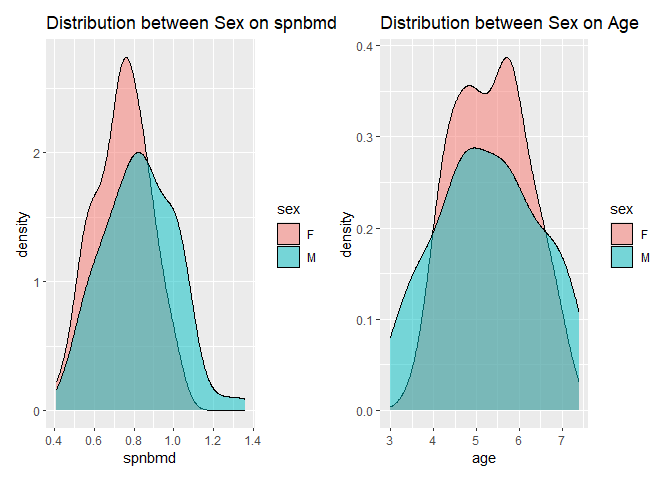<!-- -->

Although there are slight variation between the two graphs, there is
also striking similarities on both graphs. First, both graphs have
normally distributed value, specially for boys which has a very similar
plot. The females are also both have higher peaks than the males. On the
spnbmd, the female graph is slightly skewed to the right whereas on the
age, it has rise and dips in the peak. Overall, the plots suggest a more
spread of values for the boys but has a lesser peak and concentration in
the middle than the girls. Despite these differences, both groups are
respectively normally distributed.

3.  Create a scatter plot of spnbmd (y axis) versus age (x axis),
    faceting by gender. What trends do you see in this data?

``` r
p2_scatter <- ggplot(data = bmd, mapping = aes(x = age, y = spnbmd, color = sex)) +
  geom_point()  +
  facet_wrap(~ sex) +
  scale_color_manual(values = c("M" = "dodgerblue", "F" = "purple" )) +
    labs(
    title = "Scatterplot of spnbmd and age (by gender)"
  )

p2_scatter
```

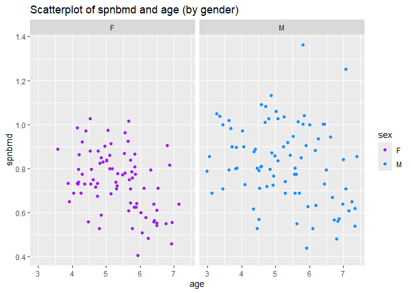<!-- -->

Upon inspecting the two plots above, both can be seen as fairly
scattered points among the both boys and girls. FOr the girls, the
values of spnbmd are scattered around the 0.4 to 1.05 margin and are
more concentrated on that range. On the other hand, the boys’ value have
a few outliers around the 1.4 margin and are more spread than the girls
despite having almost the same number of values. With the plot, there
seem to be no strong pattern between the two, which could conclude that
there are no relativity between the spnbmd and the age of the children.

## 1.4 Model (12 points)

There are clearly some trends in this data, but they are somewhat hard
to see given the substantial amount of variability. This is where
splines come in handy

### 1.4.1 Split (1 point)

``` r
set.seed(5)
n <- nrow(bmd)
```

### 1.4.2 Tune (10 points)

1.  Since the trends in spnbmd look somewhat different for boys than for
    girls, we might want to fit separate splines to these two groups.
    Separate bmd_train into bmd_train_male and bmd_train_female, and
    likewise for bmd_test.

``` r
train_samples <- sample(1:n, round(0.8*n))

bmd_train <- bmd[train_samples,]
bmd_test <- bmd[-train_samples,]

bmd_train_male <- bmd_train[bmd_train$sex == "M", ]
bmd_train_female <- bmd_train[bmd_train$sex == "F", ]

bmd_test_male <- bmd_test[bmd_test$sex == "M", ]
bmd_test_female <- bmd_test[bmd_test$sex == "F", ]
```

2.  Using cross_validate_spline from the stat471 R package, perform
    10-fold cross-validation on bmd_train_male and bmd_train_female,
    trying degrees of freedom 1,2,. . . ,15. Display the two resulting
    CV plots side by side.

3.  What are the degrees of freedom values minimizing the CV curve for
    boys and girls, and what are the values obtained from the one
    standard error rule?

``` r
cv_male <- cross_validate_spline(
  x = bmd_train_male$age, 
  y = bmd_train_male$spnbmd,
  nfolds = 10,
  df = 1:15)
```

    ## Warning in splines::ns(x, df = 0): 'df' was too small; have used 1
    ## Warning in splines::ns(x, df = 0): 'df' was too small; have used 1
    ## Warning in splines::ns(x, df = 0): 'df' was too small; have used 1
    ## Warning in splines::ns(x, df = 0): 'df' was too small; have used 1
    ## Warning in splines::ns(x, df = 0): 'df' was too small; have used 1
    ## Warning in splines::ns(x, df = 0): 'df' was too small; have used 1
    ## Warning in splines::ns(x, df = 0): 'df' was too small; have used 1
    ## Warning in splines::ns(x, df = 0): 'df' was too small; have used 1
    ## Warning in splines::ns(x, df = 0): 'df' was too small; have used 1
    ## Warning in splines::ns(x, df = 0): 'df' was too small; have used 1

``` r
cv_male
```

    ## $cv_table
    ## # A tibble: 15 × 3
    ##       df cv_mean   cv_se
    ##    <int>   <dbl>   <dbl>
    ##  1     1  0.0287 0.00287
    ##  2     2  0.0287 0.00287
    ##  3     3  0.0291 0.00312
    ##  4     4  0.0298 0.00299
    ##  5     5  0.0301 0.00302
    ##  6     6  0.0313 0.00315
    ##  7     7  0.0315 0.00292
    ##  8     8  0.0320 0.00381
    ##  9     9  0.0317 0.00423
    ## 10    10  0.0320 0.00490
    ## 11    11  0.0328 0.00521
    ## 12    12  0.0335 0.00527
    ## 13    13  0.0334 0.00516
    ## 14    14  0.0343 0.00537
    ## 15    15  0.0358 0.00634
    ## 
    ## $cv_plot

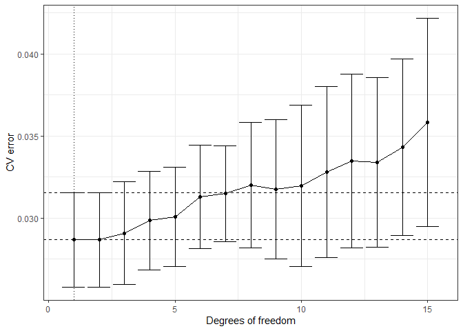<!-- -->

    ## 
    ## $df.1se
    ## [1] 1
    ## 
    ## $df.min
    ## [1] 1

``` r
cv_female <- cross_validate_spline(
  x = bmd_train_female$age, 
  y = bmd_train_female$spnbmd,
  nfolds = 10,
  df = 1:15)
```

    ## Warning in splines::ns(x, df = 0): 'df' was too small; have used 1
    ## Warning in splines::ns(x, df = 0): 'df' was too small; have used 1
    ## Warning in splines::ns(x, df = 0): 'df' was too small; have used 1
    ## Warning in splines::ns(x, df = 0): 'df' was too small; have used 1
    ## Warning in splines::ns(x, df = 0): 'df' was too small; have used 1
    ## Warning in splines::ns(x, df = 0): 'df' was too small; have used 1
    ## Warning in splines::ns(x, df = 0): 'df' was too small; have used 1
    ## Warning in splines::ns(x, df = 0): 'df' was too small; have used 1
    ## Warning in splines::ns(x, df = 0): 'df' was too small; have used 1
    ## Warning in splines::ns(x, df = 0): 'df' was too small; have used 1

``` r
cv_female
```

    ## $cv_table
    ## # A tibble: 15 × 3
    ##       df cv_mean   cv_se
    ##    <int>   <dbl>   <dbl>
    ##  1     1  0.0164 0.00239
    ##  2     2  0.0164 0.00239
    ##  3     3  0.0164 0.00243
    ##  4     4  0.0168 0.00247
    ##  5     5  0.0159 0.00226
    ##  6     6  0.0166 0.00224
    ##  7     7  0.0172 0.00216
    ##  8     8  0.0177 0.00211
    ##  9     9  0.0185 0.00272
    ## 10    10  0.0199 0.00336
    ## 11    11  0.0185 0.00221
    ## 12    12  0.0185 0.00262
    ## 13    13  0.0184 0.00250
    ## 14    14  0.0204 0.00391
    ## 15    15  0.0226 0.00620
    ## 
    ## $cv_plot

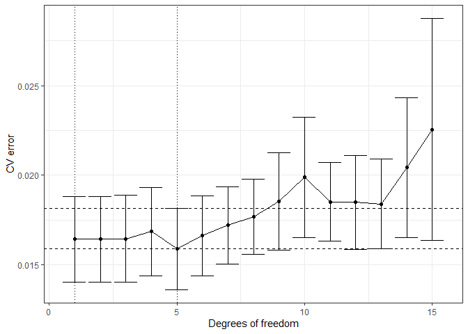<!-- -->

    ## 
    ## $df.1se
    ## [1] 1
    ## 
    ## $df.min
    ## [1] 5

For Plotting:

``` r
plot_male <- ggplot(results_table_male, aes(x = df, y = cv_mean)) +
  geom_line(color = "dodgerblue") + 
  geom_point(color = "darkblue") + 
  geom_errorbar(aes(ymin = cv_mean - cv_se, ymax = cv_mean + cv_se), width = 0.2, color = "skyblue") + 
  labs(title = "CV Error for Males", x = "Degrees of Freedom", y = "CV Error")

plot_female <- ggplot(results_table_female, aes(x = df, y = cv_mean)) +
  geom_line(color = "purple") +
  geom_point(color = "violet") +
  geom_errorbar(aes(ymin = cv_mean - cv_se, ymax = cv_mean + cv_se), width = 0.2, color = "pink") +
  labs(title = "CV Error for Females", x = "Degrees of Freedom", y = "CV Error")

library(patchwork)
plot_male + plot_female
```

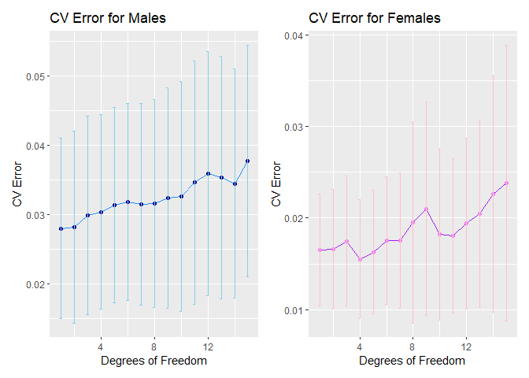<!-- -->

The graph above shows the CV error by taking the relationship between
the mean of the CV and the degrees of freedom. In both graphs, it can be
seen that the cv mean of both are on an increase from lower degrees of
freedom, both peaking at around 13 df.The cv mean for the female are on
a much lower range ok around .015 to 0.25, whereas the male starts at
around 3.5 to 4.7 mean.

Upon looking at the graph, the degrees of freedom that minimizes the cv
for girls and boys vary. For the boys, the df that minimizes the cv mean
is at 1, while the df where the cv_mean is lowest for the girls is at 4.

4.  For the sake of simplicity, let’s use the same degrees of freedom
    for males as well as females. Define df.min to be the maximum of the
    two df.min values for males and females, and define df. 1se
    likewise.Add these two spline fits to the scatter plot of spnbmd (y
    axis) versus age (x axis), faceting by gender.

``` r
df.min <- max(results_table_male$df[which.min(results_table_male$cv_mean)], results_table_female$df[which.min(results_table_female$cv_mean)])

df.1se <- max(
  results_table_male$df[which(results_table_male$cv_mean <= min(results_table_male$cv_mean) + results_table_male$cv_se[which.min(results_table_male$cv_mean)])],
  
results_table_female$df[which(results_table_female$cv_mean <= min(results_table_female$cv_mean) + 
      results_table_female$cv_se[which.min(results_table_female$cv_mean)])]
)

ggplot(bmd, aes(x = age, y = spnbmd)) +
  geom_point() +
  geom_smooth(method = "lm", formula = y ~ splines::bs(x, df = df.min), color = "blue") +
  geom_smooth(method = "lm", formula = y ~ splines::bs(x, df = df.1se), color = "red") +
  facet_wrap(~ sex) +
  labs(
    title = "Spline Fit for Bone Mineral Density by Age and Gender",
    x = "Age",
    y = "Spinal Bone Mineral Density"
  ) +
  theme_minimal()
```

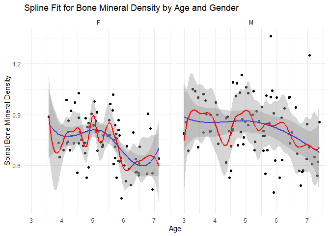<!-- -->

As a premise of the graph, the red line shows the 1se, while the blue is
showing the min.df. Observing both graphs, **The df.min (blue) shows
more promise and make more sense**. The 1se is shown to be the more
erratic one, being sensitive to every small variations and outliers. The
blue reflects a more natural and smooth curve of changes that is more
applicable to human complexities such as bone mineral density which
could explain how it changes overtime.

### 1.4.3 Final Fit (1 point)

``` r
final_spline_male <- smooth.spline(bmd_train_male$age, bmd_train_male$spnbmd, df = df.min)

final_spline_female <- smooth.spline(bmd_train_female$age, bmd_train_female$spnbmd, df = df.min)

p_male <- ggplot(bmd_train_male, aes(x = age, y = spnbmd)) +
  geom_point() +
  stat_function(fun = function(x) predict(final_spline_male, x)$y, color = "dodgerblue")+
  labs( 
  title = "Male Bone Density Relative to Age",
  xlab = "Age",
  ylab = "Spinal Bone Mineral Density"
  )

p_female <- ggplot(bmd_train_female, aes(x = age, y = spnbmd)) +
  geom_point() +
  stat_function(fun = function(x) predict(final_spline_female, x)$y, color = "purple")+
  labs(
  title = "Female Bone Density Relative to Age",
  xlab = "Age",
  ylab = "Spinal Bone Mineral Density"
  )

p_male + p_female
```

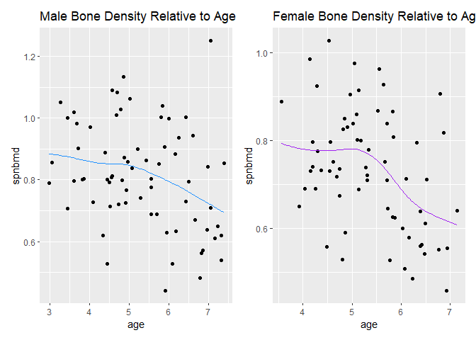<!-- -->

Using stat471, this shows the final spline models for male and female
relative to spnbmd and age. Almost similar to the test, the male bone
density is a more linear approach as it goes on a lower curver after the
age of 5. On the case of the girls, it starts in the similar age but on
a more steeper drop of both density through the 5 to 6 age mark.

## 1.5 Evaluate (2 points)

``` r
train_pred_male <- predict(final_spline_male, bmd_train_male$age)$y
test_pred_male <- predict(final_spline_male, bmd_test_male$age)$y
train_rmse_male <- sqrt(mean((bmd_train_male$spnbmd - train_pred_male)^2))
test_rmse_male <- sqrt(mean((bmd_test_male$spnbmd - test_pred_male)^2))

train_pred_female <- predict(final_spline_female, bmd_train_female$age)$y
test_pred_female <- predict(final_spline_female, bmd_test_female$age)$y
train_rmse_female <- sqrt(mean((bmd_train_female$spnbmd - train_pred_female)^2))
test_rmse_female <- sqrt(mean((bmd_test_female$spnbmd - test_pred_female)^2))

rmse_table <- data.frame(
  Gender = c("Male", "Female"),
  Training_RMSE = c(train_rmse_male, train_rmse_female),
  Test_RMSE = c(test_rmse_male, test_rmse_female)
)

print(rmse_table)
```

    ##   Gender Training_RMSE Test_RMSE
    ## 1   Male     0.1600895 0.2126332
    ## 2 Female     0.1184687 0.1271087

Since for the both male and female, the Test RMSE is not higher than the
training RMSE, it does not indicate overfitting, and since both values
are close to each other for both male and female, it does not indicate
underfitting as well. Upon these observations, it could be concluded
that the error is generalized well for both genders.

## 1.6 Interpret (6 points)

``` r
p2_scatter <- ggplot(data = bmd, mapping = aes(x = age, y = spnbmd, color = sex)) +
  geom_point() +
    stat_function(fun = function(x) predict(final_spline_male, x)$y, color = "dodgerblue")+
  stat_function(fun = function(x) predict(final_spline_female, x)$y, color = "purple") +
  scale_color_manual(values = c("M" = "dodgerblue", "F" = "purple")) +
  labs(
    title = "Scatterplot of spnbmd and age"
  )

p2_scatter
```

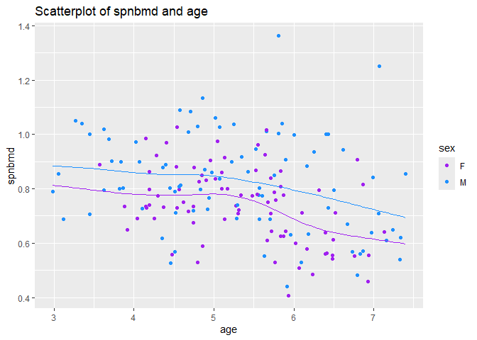<!-- -->

By looking at the scatterplot above, the blue spline for the boys,
appear to peak on growth spurt at around 4.5 to 5, while the girls on
the purple spline appear mauch earlier at 4. Both starts levelling off
the moment they reach the 6th year interval, with girls also starting
their earlier. As far as I know, this seems right due to the known
timeline of growth for both men and women. It is typically the women who
develops the bone density earlier, evident with their height being
relatively taller than boys in a young age, but would stunt much earlier
whereas the boys would unexpectedly grow on their pre-teen age.
Therefore, I agree that these data seem reasonable in a real-world
application.

# 2 KNN and bias-variance tradeoff (55 points for correctness; 8 points for presentation)

## 2.1 A simple rule to predict this season’s yield (15 points)

1.  What is the training error of such a rule?

Since the prediction rule is based on last year’s yield, the predicted
value for a tree this year is equal to the actual yield last year. By
that, we can use the **Mean Squared Error (MSE)** to check how well the
prediction of the model match the actual data of the last year’s yield

MSE is defined as:

$$
\frac{1}{N} \sum_{i=1}^{N} (Y_i - \hat{Y}_i)^2
$$ Where Yi is the last year’s yield Yi_hat is the predicted yield for
this year.

2.  What is the mean squared bias, mean variance, and expected test
    error of this prediction rule?

Using the defined formula for Mean Squared Bias:

$$
\text{Bias}^2 = \left[ \mathbb{E}(\hat{Y}) - f(E) \right]^2
$$ The expected prediction is: $$
\mathbb{E}(\hat{Y}_i) = \mathbb{E}(Y_i) = f(E) + \mathbb{E}(\epsilon_i) = f(E) + 0 = f(E)
$$

Using this, the value for squared bias is: $$
\text{Bias}^2 = \left[ f(E) - f(E) \right]^2 = 0
$$

For the Mean Variance, the variance measures how much the prediction
varies around its expected value:

$$
\text{Var}(\hat{Y}) = \mathbb{E} \left[ (\hat{Y} - \mathbb{E}(\hat{Y}))^2 \right]
$$

Since $$
( \hat{Y} = Y = f(E) + \epsilon)
$$ the variance becomes:

$$
\text{Var}(\hat{Y}) = \text{Var}(f(E) + \epsilon) = \text{Var}(\epsilon) = \sigma^2 = 4^2 = 16
$$

Lastly, the expected test error is given by the bias-variance
decomposition. Using the values earlier (Mean Squared Bias = 0, Variance
= 4), we get:

$$
\mathbb{E} \left[ (Y - \hat{Y})^2 \right] = (0 + 16) +(0 + 16) = 32
$$

3.  Why is this not the best possible prediction rule?

Since the prediction model relies heavily on the previous year’s data,
this prediction could disrupt and add noise to the actual yielding
result. Because of its over-reliance to last year’s data, the expected
variance could be high and would be hard to prevent by lowering the
bias. In addition, in a real-life setting, many external factors such as
seasonal change, rain, and even deterioration of soil are not a constant
factor and could be a huge factor in affecting the current yield for
this year.

## 2.2 K-nearest neighbors regression (conceptual) (15 points)

1.  What happens to the model complexity as K increases? Why?

- Since there is a inverse relationship between the complexity of the
  model and the K, as K increases, **the model complexity decreases**
  because the line becomes smoother and less susceptible to noise. As
  increases, the model averages over more neighboring points, smoothing
  out the noise and leading to a simpler, less flexible model.

2.  The degrees of freedom for KNN is sometimes considered n/K, where n
    is the training set size. Why might this be the case? \[Hint:
    consider a situation where the data are clumped in groups of K.\]

- Because when the data are grouped into clusters of size , the
  prediction for each new point is influenced by approximately clusters.
  Similar to 1, the larger K reduces the number of independent cluster,
  thus lowering the degrees of freedom.

3.  Conceptually, why might increasing K tend to improve the prediction
    rule? What does this have to do with the bias-variance tradeoff?

- In checking the prediction rule, there are always two factors that
  must be considered to identify the prediction rule. the Bias and the
  Variance. increasing the K could technically help improve the
  prediction rule because it **lowers the variance**, thus leading to
  less susceptibility to noise and outliers on the data.

4.  Conceptually, why might increasing K tend to worsen the prediction
    rule? What does this have to do with the bias-variance tradeoff?

- On the other hand, it risks the value of having **high bias**,
  changing the model and lessening its fit. With less susceptibility to
  noise, there may be a risk that the model shows nothing because
  changes in data does not change anything anymore.

## 2.3 K-nearest neighbors regression (simulation) (25 points)

``` r
training_results_summary <- readRDS("E:/Downloads/training_results_summary.rds")
training_results_summary
```

    ## # A tibble: 6,174 × 5
    ##        K    X1    X2    bias variance
    ##    <dbl> <dbl> <dbl>   <dbl>    <dbl>
    ##  1     1     0     0 -0.25       16.2
    ##  2     1     0    10  0.14       12.2
    ##  3     1     0    20 -0.523      20.4
    ##  4     1     0    30  0.109      15.6
    ##  5     1     0    40 -0.566      21.4
    ##  6     1     0    50 -0.336      15.9
    ##  7     1     0    60 -1.04       12.4
    ##  8     1     0    70 -0.0213     12.4
    ##  9     1     0    80  0.045      18.3
    ## 10     1     0    90 -0.312      14.7
    ## # ℹ 6,164 more rows

``` r
overall_results <- training_results_summary %>%
  group_by(K) %>%
  summarise(
    mean_sq_bias = (mean(bias^2)),  
    mean_variance = mean(variance), 
    expected_test_error = mean(bias^2 + variance) 
  )

print(overall_results)
```

    ## # A tibble: 10 × 4
    ##        K mean_sq_bias mean_variance expected_test_error
    ##    <dbl>        <dbl>         <dbl>               <dbl>
    ##  1     1        0.280          17.5                17.8
    ##  2     2        0.256          17.4                17.6
    ##  3     3        0.227          17.7                17.9
    ##  4     4        0.264          17.7                18.0
    ##  5     5        0.255          17.8                18.0
    ##  6     6        0.252          17.3                17.6
    ##  7     7        0.244          17.7                18.0
    ##  8     8        0.232          17.6                17.8
    ##  9     9        0.232          17.6                17.9
    ## 10    10        0.240          17.6                17.9

``` r
ggplot(overall_results, aes(x = K)) +
  geom_line(aes(y = mean_sq_bias, color = "Mean Squared Bias")) +
  geom_line(aes(y = mean_variance, color = "Mean Variance")) +
  geom_line(aes(y = expected_test_error, color = "Expected Test Error")) +
  labs(
    title = "Bias-Variance Tradeoff vs K",
    x = "K",
    y = "Value"
  ) +
  scale_color_manual(
    values = c("Mean Squared Bias" = "purple", 
               "Mean Variance" = "dodgerblue", 
               "Expected Test Error" = "red")
  )+
  scale_x_continuous(breaks = seq(1, 10, 1), limits = c(1, 10))
```

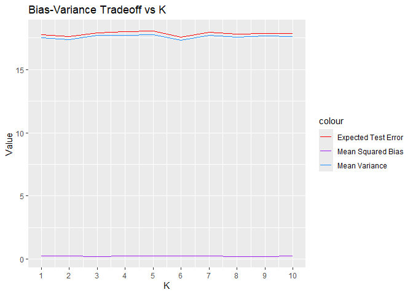<!-- -->
Since the expected test error is substantially on the high, the value
for this expected test error is not the ideal value of K.

3.  We are used to the bias decreasing and the variance increasing when
    going from left to right in the plot. Here, the trend seems to be
    reversed. Why is this the case?

There may be a few possible reasons for this. First is the availability
of outliers if there is. The dataset may be small if only the mean for
each K is taken, by taking the average of for the values, the outlier
may predominantly affect the final value. Also, small sample sizes such
as these can make both variance and bias unstable.

4.  The mean squared bias has a strange bump between K = 1 and K = 5,
    increasing from K = 1 to K = 2 but then decreasing from K = 2 to K
    = 5. Why does this bump occur? \[Hint: Think about the rectangular
    grid configuration of the trees. So for a given tree, the closest
    tree is itself, and then the next closest four trees are the ones
    that are one tree up, down, left, and right from it.\]

The bump that can be seen can be explained because at K = 1, the basis
is the tree is the only basis itself at first. At the increase to 2, the
model starts to average the yield of the target tree with the yield of
the closest neighboring tree, which might be in a different part of the
grid or influenced by local variations, increasing the bias. As the 2 to
5 happens, the curve starts to smoothen, creating a more balanced
estimation for the overall yield.

5.  Based on the information in training_results_summary, which tree and
    which value of K gives the overall highest absolute bias? Does the
    sign of the bias make sense? Why do this particular tree and this
    particular value of K give us the largest absolute bias?

``` r
highest_bias <- training_results_summary %>%
  arrange(desc(bias)) %>%
  head(1)

highest_bias
```

    ## # A tibble: 1 × 5
    ##       K    X1    X2  bias variance
    ##   <dbl> <dbl> <dbl> <dbl>    <dbl>
    ## 1     4     0    10  1.97     18.2

Taking the highest bias, this tree with 1.97 bias value. But taking the
absolute highest bias,

``` r
highest_abs_bias <- training_results_summary %>%
  arrange(desc(abs(bias))) %>%
  head(1)

highest_abs_bias
```

    ## # A tibble: 1 × 5
    ##       K    X1    X2  bias variance
    ##   <dbl> <dbl> <dbl> <dbl>    <dbl>
    ## 1     1     0    70 -2.06     13.9

Even with the negative value for bias, this has the highest with 2.059
value.

Although each bias for K are relatively close to each other, the K with
the highest bias is K = 1. As said in the previous number, it is because
the first K is the basis of all itself, that’s why it yields the highest
bias.

``` r
n <-  6174

overall_results <- overall_results %>%
  mutate(df = n / K)

ggplot(overall_results, aes(x = df)) +
  geom_line(aes(y = mean_sq_bias, color = "Mean Squared Bias")) +
  geom_line(aes(y = mean_variance, color = "Mean Variance")) +
  geom_line(aes(y = expected_test_error, color = "Expected Test Error")) +
  labs(
    title = "Bias-Variance Tradeoff vs Degrees of Freedom (df = n/K)",
    x = "Degrees of Freedom (df)",
    y = "Value"
  ) +
  scale_color_manual(
    values = c("Mean Squared Bias" = "purple", 
               "Mean Variance" = "dodgerblue", 
               "Expected Test Error" = "red")
  )
```

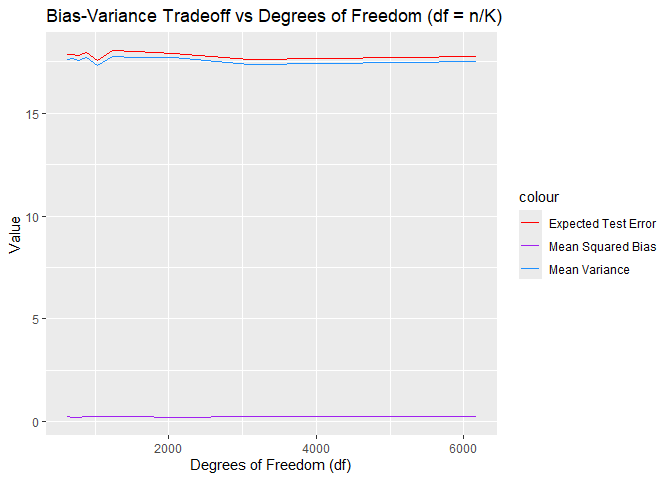<!-- -->

Upon doing the n/k, there are slight changes from the previous iteration
of the plot. Although the variance is still relatively high, the
erracticness that occured in around 6 has been removed, but in return,
there is a slight dip in the 1000 mark. Other than that, there are
little to no minimal changes for the graph itself.

Derive a formula for the KNN mean variance. \[Hint: First, write down an
expression for the KNN prediction for a given tree. Then, compute the
variance of this quantity using the fact that the variance of the
average of N independent random variables each with variance s2 is s2/N
. Finally, compute the mean variance by averaging over trees.\]

- The KNN prediction for a given tree at a point x is the average of the
  target values of the K nearest neighbors: $$
  \hat{f}_K(x) = \frac{1}{K} \sum_{i = 1}^K Y_i
  $$ where Yi is the ith neighbor and K is the number of neighbors.

We assume that the Y_i values are independent and have variance
sigma^2.  
The variance of the average of K independent random variables is: $$
\text{Var}(\hat{f}_K(x)) = \frac{\sigma^2}{K}
$$

To get the mean variance across all trees (or all possible test points),
we take the average over the distribution of input values: $$
\text{Mean variance} = \frac{\sigma^2}{K}
$$

Using the FNN library, the mean variance:

``` r
X <- training_results_summary[, c("X1", "X2")]
y <- training_results_summary$bias

mean_variance2 <- sapply(K, function(k) {
  knn_fit <- knn.reg(train = X, test = X, y = y, k = k)
  var(knn_fit$pred)
})
s2 <- var(y)
theoretical_variance <- s2 / K

overall_results <- tibble(
  K = K,
  mean_variance = mean_variance2,
)
print(overall_results)
```

    ## # A tibble: 1 × 2
    ##       K mean_variance
    ##   <dbl>         <dbl>
    ## 1    10        0.0180

``` r
overall_results <- training_results_summary %>%
  group_by(K) %>%
  summarise(
    mean_sq_bias = mean(bias^2, na.rm = TRUE),
    old_variance = mean(variance, na.rm = TRUE), 
    new_variance = mean_variance2
  ) %>%
  mutate(
    old_expected_test_error = mean_sq_bias + old_variance,
    new_expected_test_error = mean_sq_bias + new_variance,
    df = n / K
  )

ggplot(overall_results, aes(x = df)) +
  geom_line(aes(y = mean_sq_bias, color = "Mean Squared Bias")) +
  geom_line(aes(y = old_variance, color = "Mean Variance")) +
  geom_line(aes(y = old_expected_test_error, color = "Expected Test Error")) +
    geom_line(aes(y = new_expected_test_error, color = "New Expected Test Error"), linetype = "dashed") +
  geom_line(aes(y = new_variance, color = "New Mean Variance"), linetype = "dashed") +
  labs(
    title = "Bias-Variance Tradeoff vs Degrees of Freedom (df = n/K)",
    x = "Degrees of Freedom (df)",
    y = "Value"
  ) +
  scale_color_manual(
    values = c(
      "Mean Squared Bias" = "purple", 
      "Mean Variance" = "dodgerblue", 
      "Expected Test Error" = "red", 
      "New Mean Variance" = "skyblue",
      "New Expected Test Error" = "darkred"
    )
  )
```

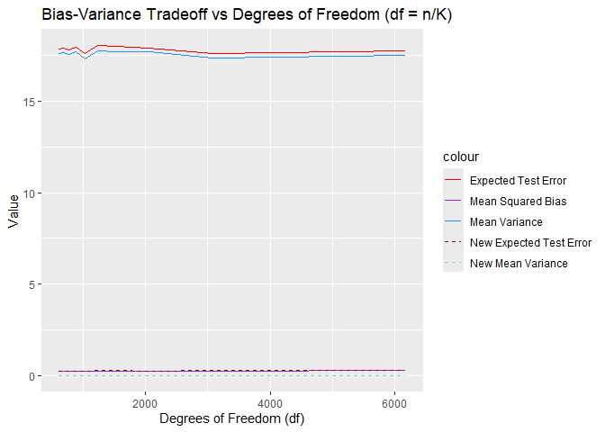<!-- -->

The values of the mean variance and the new mean variance have an almost
identical linearity, but the old mean variance is lying on the same
value, while the new mean variance is lower as it is close to zero.
Although this is the case, the two variances still match in curvature.
Using the new mean variance to the expected test error, it becomes a
more fit model.
