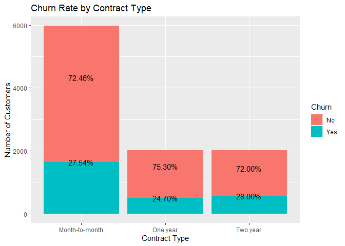
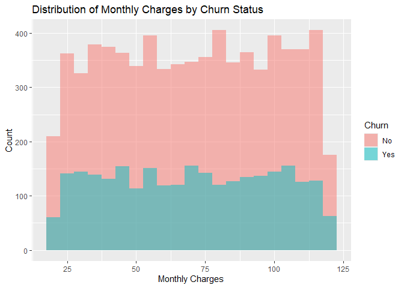
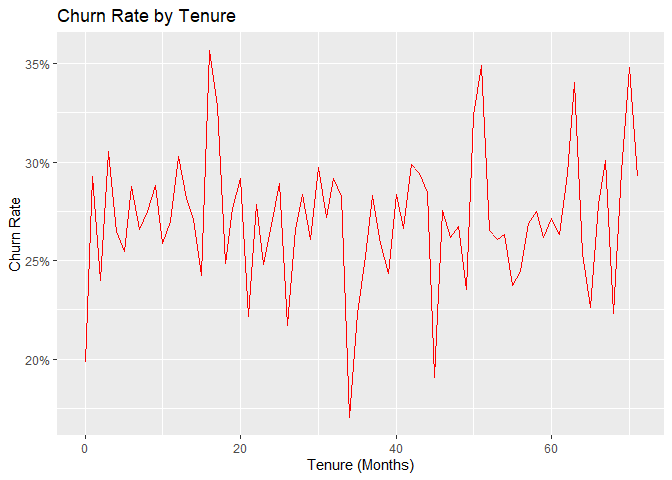
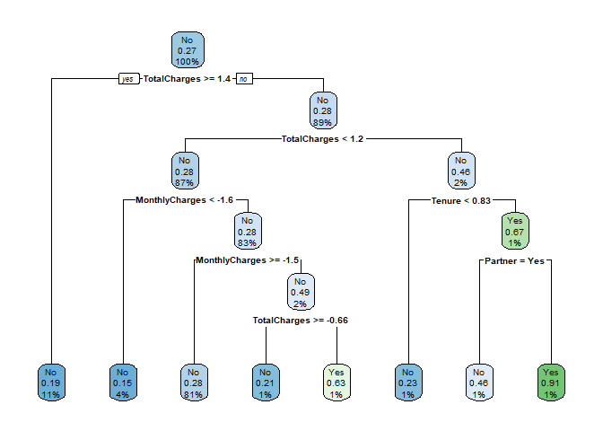

================
Rodillas
2025-03-19

## Unit 1: R for Data Mining

### 1. Intro to Modern Data Mining

``` r
churn_df <- read.csv("E:/Downloads/customer_churn.csv")

head(churn_df)
```

    ##   CustomerID Gender SeniorCitizen Partner Dependents Tenure PhoneService
    ## 1  CUST00001   Male             0      No         No     65          Yes
    ## 2  CUST00002   Male             0      No         No     26          Yes
    ## 3  CUST00003   Male             0     Yes         No     54          Yes
    ## 4  CUST00004 Female             0     Yes        Yes     70          Yes
    ## 5  CUST00005   Male             0      No         No     53          Yes
    ## 6  CUST00006 Female             0      No        Yes     45          Yes
    ##   InternetService       Contract MonthlyCharges TotalCharges Churn
    ## 1     Fiber optic Month-to-month          20.04      1302.60    No
    ## 2     Fiber optic Month-to-month          65.14      1693.64    No
    ## 3     Fiber optic Month-to-month          49.38      2666.52    No
    ## 4             DSL       One year          31.19      2183.30    No
    ## 5             DSL Month-to-month         103.86      5504.58   Yes
    ## 6     Fiber optic Month-to-month          87.34      3930.30   Yes

This is the first 6 rows of the data set. The customer_churn.csv
contains the customers demographics such has customer ID, gender, status
(Senior Citizen, Availability of Partner & Dependents) as well as
internet contract details such as Tenure, Phone and Internet Service,
Contract, and Charges, as well as Churn.

``` r
dim(churn_df)
```

    ## [1] 10000    12

Listing all columns, the dataset has 12 columns and 10000 rows,
accounting for exactly 10000 of the customers.

``` r
str(churn_df)
```

    ## 'data.frame':    10000 obs. of  12 variables:
    ##  $ CustomerID     : chr  "CUST00001" "CUST00002" "CUST00003" "CUST00004" ...
    ##  $ Gender         : chr  "Male" "Male" "Male" "Female" ...
    ##  $ SeniorCitizen  : int  0 0 0 0 0 0 0 0 0 0 ...
    ##  $ Partner        : chr  "No" "No" "Yes" "Yes" ...
    ##  $ Dependents     : chr  "No" "No" "No" "Yes" ...
    ##  $ Tenure         : int  65 26 54 70 53 45 35 20 48 33 ...
    ##  $ PhoneService   : chr  "Yes" "Yes" "Yes" "Yes" ...
    ##  $ InternetService: chr  "Fiber optic" "Fiber optic" "Fiber optic" "DSL" ...
    ##  $ Contract       : chr  "Month-to-month" "Month-to-month" "Month-to-month" "One year" ...
    ##  $ MonthlyCharges : num  20 65.1 49.4 31.2 103.9 ...
    ##  $ TotalCharges   : num  1303 1694 2667 2183 5505 ...
    ##  $ Churn          : chr  "No" "No" "No" "No" ...

``` r
colSums(is.na(churn_df)) 
```

    ##      CustomerID          Gender   SeniorCitizen         Partner      Dependents 
    ##               0               0               0               0               0 
    ##          Tenure    PhoneService InternetService        Contract  MonthlyCharges 
    ##               0               0               0               0               0 
    ##    TotalCharges           Churn 
    ##               0               0

There are no null values for each column, but this could be accounted
for by its unfit data types.

``` r
summary(churn_df)
```

    ##   CustomerID           Gender          SeniorCitizen      Partner         
    ##  Length:10000       Length:10000       Min.   :0.0000   Length:10000      
    ##  Class :character   Class :character   1st Qu.:0.0000   Class :character  
    ##  Mode  :character   Mode  :character   Median :0.0000   Mode  :character  
    ##                                        Mean   :0.1502                     
    ##                                        3rd Qu.:0.0000                     
    ##                                        Max.   :1.0000                     
    ##   Dependents            Tenure      PhoneService       InternetService   
    ##  Length:10000       Min.   : 0.00   Length:10000       Length:10000      
    ##  Class :character   1st Qu.:17.00   Class :character   Class :character  
    ##  Mode  :character   Median :35.00   Mode  :character   Mode  :character  
    ##                     Mean   :35.22                                        
    ##                     3rd Qu.:53.00                                        
    ##                     Max.   :71.00                                        
    ##    Contract         MonthlyCharges    TotalCharges       Churn          
    ##  Length:10000       Min.   : 20.02   Min.   :   0.0   Length:10000      
    ##  Class :character   1st Qu.: 44.88   1st Qu.: 961.2   Class :character  
    ##  Mode  :character   Median : 70.56   Median :2025.6   Mode  :character  
    ##                     Mean   : 70.18   Mean   :2455.8                     
    ##                     3rd Qu.: 95.77   3rd Qu.:3611.0                     
    ##                     Max.   :119.99   Max.   :8425.6

Looking at the overview of the dataset given, it provides sophisticated
data of a large phone and internet service business that includes the
details of every customers under the said provider. Data Mining provides
a much needed dimension to the business as it procures actions that
greatly improves the business. First, data mining can help identify
patterns and trends among pre-existing customers, and factors that may
help affect these patterns. It opens up a new possibility to data
prediction based on the likelihood of a customer churning based on the
factors stated.

In addition, data mining also provides the business an overview of both
their target market, and their service improvement. Allowing for a much
more systematic understanding and a visualization of the growth, or even
the decline, of business.

### 2. Data Visualization

``` r
churn_contract <- ggplot(data = churn_df, mapping = aes(Contract, fill = Churn)) +
  geom_bar() + 
  geom_text(
    stat = "count",
    aes(label = scales::percent(..count.. / tapply(..count.., ..x.., sum)[..x..]))
  ) +
  labs(
    title = "Churn Rate by Contract Type", 
    x = "Contract Type", 
    y = "Number of Customers") 
churn_contract
```

    ## Warning: The dot-dot notation (`..count..`) was deprecated in ggplot2 3.4.0.
    ## ℹ Please use `after_stat(count)` instead.
    ## This warning is displayed once every 8 hours.
    ## Call `lifecycle::last_lifecycle_warnings()` to see where this warning was
    ## generated.

<!-- -->

##### Figure 1. Churn Rate of the Customers Based on the Contract Type

Above is a modified bar graph that allows us to check the
proportionality of churn rate by contract. Looking at the figure,
Month-to-Month holds most of the subscription fit for customers wanting
to try the provided service on a short-term basis. It holds 27.54% Churn
Rate. On the other hand, both the One Year and the Two Year Types almost
hold the same number of customers. Upon reviewing, One Year holds the
lowest percentage of customers cancelling their subscription at 24.7%,
while two year holds the highest at 28.00%, meaning that One Year
contracts hold the least likely for the customer to churn.

``` r
churn_mcharges <- ggplot(churn_df, aes(x = MonthlyCharges, fill = Churn)) +
  geom_histogram(position = "identity", 
                 alpha = 0.5, 
                 binwidth = 5) +
  labs(
    title = "Distribution of Monthly Charges by Churn Status", 
    x = "Monthly Charges", 
    y = "Count"
  ) 

churn_mcharges
```

<!-- -->

##### Figure 2. Churn Status Histogram based on the Monthly Charges

Figure 2 shows how much the monthly charges affects the churn rate of
the customers. Based on the graph, Most of the ranges of customers
churning in monthly charges hovers around 100 to 150, having customers
70 per month getting the lowest churn rate to count ratio. On the
flipside, charges around the range of 75 to 80 per month provides the
most profitable range for the business.

``` r
tenure_churn_data <- churn_df %>%
  group_by(Tenure, Churn) %>%
  summarise(count = n()) %>%
  group_by(Tenure) %>%
  mutate(rate = count / sum(count)) %>%
  filter(Churn == "Yes")
```

    ## `summarise()` has grouped output by 'Tenure'. You can override using the
    ## `.groups` argument.

``` r
churn_tenure <- ggplot(tenure_churn_data, aes(x = Tenure, y = rate)) +
  geom_line(color = "red") +
  scale_y_continuous(labels = scales::percent) +
  labs(
    title = "Churn Rate by Tenure",
    x = "Tenure (Months)",
    y = "Churn Rate"
  ) 

churn_tenure
```

<!-- -->

##### Figure 3. Churn Rate Line Plot based on Tenure

The line plot above shows the Churn rate of the customers based on the
longevity of their tenure in the provider. The plot shows at which
months usually customers end their contract. Looking at it, the most
critical points of the churn rate sits at around 15 to 17, 50, and at
around 63, all of which sits around the 35% churn rate.

### 3. Data Transformation

``` r
unique(churn_df$SeniorCitizen)
```

    ## [1] 0 1

Looking at these unique values for senior citizen, it is safe to assume
that this was used to identify if the customer belong to this particular
age group. For uniformity, we can change 0=no and 1= yes
churn_df$SeniorCitizen <- ifelse(churn_df$SeniorCitizen == 1, “Yes”,
“No”)

``` r
churn_df$SeniorCitizen <- ifelse(churn_df$SeniorCitizen == 1, "Yes", "No")
```

Converting categorical into factors:

``` r
churn_df$Gender <- as.factor(churn_df$Gender)
churn_df$Partner <- as.factor(churn_df$Partner)
churn_df$Dependents <- as.factor(churn_df$Dependents)
churn_df$PhoneService <- as.factor(churn_df$PhoneService)
churn_df$InternetService <- as.factor(churn_df$InternetService)
churn_df$Contract <- as.factor(churn_df$Contract)
churn_df$Churn <- as.factor(churn_df$Churn)
```

Stardardizing numerical features:

``` r
churn_df$MonthlyCharges <- scale(churn_df$MonthlyCharges)
churn_df$TotalCharges <- scale(churn_df$TotalCharges)
churn_df$Tenure <- scale(churn_df$Tenure)
```

### 4. Data Wrangling

Creating a function, I used the IQR to filter unnecessary outliers:

``` r
filter_outliers <- function(data, cols) {
  for (col in cols) {
    Q1 <- quantile(data[[col]], 0.25, na.rm = TRUE)
    Q3 <- quantile(data[[col]], 0.75, na.rm = TRUE)
    IQR <- Q3 - Q1
    
    data <- data %>%
      filter(data[[col]] >= (Q1 - 1.5 * IQR) & data[[col]] <= (Q3 + 1.5 * IQR))
  }
  
  return(data)
}

churn_df <- filter_outliers(churn_df, c("MonthlyCharges", "TotalCharges"))
```

    ## Warning: Using one column matrices in `filter()` was deprecated in dplyr 1.1.0.
    ## ℹ Please use one dimensional logical vectors instead.
    ## This warning is displayed once every 8 hours.
    ## Call `lifecycle::last_lifecycle_warnings()` to see where this warning was
    ## generated.

Creating new Dervied Variables:

I added two columns, the total contract value which provides the total
number a contract has provided, as well as tenure group to easily filter
each groups

``` r
churn_df <- churn_df %>%
  mutate(Total_Contract_Value = MonthlyCharges * Tenure)

churn_df <- churn_df %>%
  mutate(Tenure_Group = case_when(
    Tenure <= 12 ~ "New",
    Tenure <= 36 ~ "Intermediate",
    TRUE ~ "Loyal"
  ))
```

This is the new head of the data set with 2 new additional variables:

``` r
head(churn_df)
```

    ##   CustomerID Gender SeniorCitizen Partner Dependents     Tenure PhoneService
    ## 1  CUST00001   Male            No      No         No  1.4325824          Yes
    ## 2  CUST00002   Male            No      No         No -0.4435707          Yes
    ## 3  CUST00003   Male            No     Yes         No  0.9034110          Yes
    ## 4  CUST00004 Female            No     Yes        Yes  1.6731149          Yes
    ## 5  CUST00005   Male            No      No         No  0.8553045          Yes
    ## 6  CUST00006 Female            No      No        Yes  0.4704526          Yes
    ##   InternetService       Contract MonthlyCharges TotalCharges Churn
    ## 1     Fiber optic Month-to-month     -1.7273002   -0.6218138    No
    ## 2     Fiber optic Month-to-month     -0.1736089   -0.4109640    No
    ## 3     Fiber optic Month-to-month     -0.7165396    0.1136155    No
    ## 4             DSL       One year     -1.3431836   -0.1469380    No
    ## 5             DSL Month-to-month      1.1602920    1.6439049   Yes
    ## 6     Fiber optic Month-to-month      0.5911793    0.7950490   Yes
    ##   Total_Contract_Value Tenure_Group
    ## 1          -2.47449991          New
    ## 2           0.07700781          New
    ## 3          -0.64732977          New
    ## 4          -2.24730048          New
    ## 5           0.99240298          New
    ## 6           0.27812185          New

## Unit 2: Tuning Predictive Models

### 6. Model Complexity

``` r
set.seed(777)

trIndex <-createDataPartition(churn_df$Churn,
                              p = 0.8,
                              list = FALSE)
train_df <- churn_df[trIndex,]
test_df <- churn_df[-trIndex,]
```

``` r
test_df$TotalCharges[is.na(test_df$TotalCharges)] <- median(test_df$TotalCharges, na.rm=TRUE)

#decision tree
DT_churn <- rpart(Churn ~ Tenure + MonthlyCharges + TotalCharges + Gender + Partner + Dependents + PhoneService + InternetService + Contract, 
                             data = test_df, 
                             method = "class", 
                             control = rpart.control(cp = 0, maxdepth = 5))

summary(DT_churn)
```

    ## Call:
    ## rpart(formula = Churn ~ Tenure + MonthlyCharges + TotalCharges + 
    ##     Gender + Partner + Dependents + PhoneService + InternetService + 
    ##     Contract, data = test_df, method = "class", control = rpart.control(cp = 0, 
    ##     maxdepth = 5))
    ##   n= 1985 
    ## 
    ##            CP nsplit rel error   xerror       xstd
    ## 1 0.004956629      0 1.0000000 1.000000 0.03680975
    ## 2 0.004337051      3 0.9851301 1.018587 0.03702168
    ## 3 0.001858736      6 0.9721190 1.024164 0.03708411
    ## 4 0.000000000      7 0.9702602 1.042751 0.03728841
    ## 
    ## Variable importance
    ##  MonthlyCharges    TotalCharges          Tenure         Partner InternetService 
    ##              32              32              24               7               2 
    ##        Contract 
    ##               2 
    ## 
    ## Node number 1: 1985 observations,    complexity param=0.004956629
    ##   predicted class=No   expected loss=0.2710327  P(node) =1
    ##     class counts:  1447   538
    ##    probabilities: 0.729 0.271 
    ##   left son=2 (219 obs) right son=3 (1766 obs)
    ##   Primary splits:
    ##       TotalCharges   < 1.381561    to the right, improve=3.0921710, (0 missing)
    ##       MonthlyCharges < -1.612582   to the left,  improve=1.9851580, (0 missing)
    ##       Dependents     splits as  LR, improve=0.9812850, (0 missing)
    ##       Tenure         < 0.7350383   to the right, improve=0.9460228, (0 missing)
    ##       Partner        splits as  RL, improve=0.7818585, (0 missing)
    ##   Surrogate splits:
    ##       MonthlyCharges < 1.705634    to the right, agree=0.89, adj=0.005, (0 split)
    ## 
    ## Node number 2: 219 observations
    ##   predicted class=No   expected loss=0.1917808  P(node) =0.1103275
    ##     class counts:   177    42
    ##    probabilities: 0.808 0.192 
    ## 
    ## Node number 3: 1766 observations,    complexity param=0.004956629
    ##   predicted class=No   expected loss=0.2808607  P(node) =0.8896725
    ##     class counts:  1270   496
    ##    probabilities: 0.719 0.281 
    ##   left son=6 (1720 obs) right son=7 (46 obs)
    ##   Primary splits:
    ##       TotalCharges   < 1.236858    to the left,  improve=2.914748, (0 missing)
    ##       MonthlyCharges < -1.612582   to the left,  improve=2.346257, (0 missing)
    ##       Partner        splits as  RL, improve=1.350420, (0 missing)
    ##       Dependents     splits as  LR, improve=1.092239, (0 missing)
    ##       Tenure         < 1.649062    to the left,  improve=1.024808, (0 missing)
    ## 
    ## Node number 6: 1720 observations,    complexity param=0.004337051
    ##   predicted class=No   expected loss=0.2761628  P(node) =0.8664987
    ##     class counts:  1245   475
    ##    probabilities: 0.724 0.276 
    ##   left son=12 (71 obs) right son=13 (1649 obs)
    ##   Primary splits:
    ##       MonthlyCharges < -1.612582   to the left,  improve=2.1769040, (0 missing)
    ##       Dependents     splits as  LR, improve=1.2300510, (0 missing)
    ##       TotalCharges   < 0.3378914   to the left,  improve=1.1487250, (0 missing)
    ##       Partner        splits as  RL, improve=0.9546202, (0 missing)
    ##       Tenure         < 0.7350383   to the right, improve=0.7536061, (0 missing)
    ## 
    ## Node number 7: 46 observations,    complexity param=0.004956629
    ##   predicted class=No   expected loss=0.4565217  P(node) =0.0231738
    ##     class counts:    25    21
    ##    probabilities: 0.543 0.457 
    ##   left son=14 (22 obs) right son=15 (24 obs)
    ##   Primary splits:
    ##       Tenure         < 0.8312513   to the left,  improve=4.4321480, (0 missing)
    ##       MonthlyCharges < 0.7391417   to the right, improve=3.5217390, (0 missing)
    ##       Partner        splits as  RL, improve=2.0413250, (0 missing)
    ##       TotalCharges   < 1.317455    to the right, improve=1.2822270, (0 missing)
    ##       Contract       splits as  LRR, improve=0.2626461, (0 missing)
    ##   Surrogate splits:
    ##       MonthlyCharges  < 0.6991798   to the right, agree=0.957, adj=0.909, (0 split)
    ##       TotalCharges    < 1.262748    to the left,  agree=0.587, adj=0.136, (0 split)
    ##       InternetService splits as  RRL, agree=0.587, adj=0.136, (0 split)
    ##       Contract        splits as  LRR, agree=0.587, adj=0.136, (0 split)
    ## 
    ## Node number 12: 71 observations
    ##   predicted class=No   expected loss=0.1549296  P(node) =0.03576826
    ##     class counts:    60    11
    ##    probabilities: 0.845 0.155 
    ## 
    ## Node number 13: 1649 observations,    complexity param=0.004337051
    ##   predicted class=No   expected loss=0.2813827  P(node) =0.8307305
    ##     class counts:  1185   464
    ##    probabilities: 0.719 0.281 
    ##   left son=26 (1608 obs) right son=27 (41 obs)
    ##   Primary splits:
    ##       MonthlyCharges < -1.517845   to the right, improve=3.5831200, (0 missing)
    ##       Partner        splits as  RL, improve=1.2543260, (0 missing)
    ##       TotalCharges   < 1.199014    to the right, improve=1.0955330, (0 missing)
    ##       Dependents     splits as  LR, improve=1.0529590, (0 missing)
    ##       PhoneService   splits as  RL, improve=0.8110087, (0 missing)
    ## 
    ## Node number 14: 22 observations
    ##   predicted class=No   expected loss=0.2272727  P(node) =0.01108312
    ##     class counts:    17     5
    ##    probabilities: 0.773 0.227 
    ## 
    ## Node number 15: 24 observations,    complexity param=0.001858736
    ##   predicted class=Yes  expected loss=0.3333333  P(node) =0.01209068
    ##     class counts:     8    16
    ##    probabilities: 0.333 0.667 
    ##   left son=30 (13 obs) right son=31 (11 obs)
    ##   Primary splits:
    ##       Partner        splits as  RL, improve=2.3869460, (0 missing)
    ##       MonthlyCharges < 0.2620103   to the left,  improve=1.3333330, (0 missing)
    ##       Tenure         < 1.504742    to the right, improve=0.6666667, (0 missing)
    ##       Gender         splits as  RL, improve=0.5967366, (0 missing)
    ##       TotalCharges   < 1.291779    to the left,  improve=0.3555556, (0 missing)
    ##   Surrogate splits:
    ##       TotalCharges    < 1.273076    to the right, agree=0.708, adj=0.364, (0 split)
    ##       Tenure          < 1.11989     to the right, agree=0.625, adj=0.182, (0 split)
    ##       MonthlyCharges  < -0.05716816 to the right, agree=0.625, adj=0.182, (0 split)
    ##       InternetService splits as  LLR, agree=0.583, adj=0.091, (0 split)
    ## 
    ## Node number 26: 1608 observations
    ##   predicted class=No   expected loss=0.2761194  P(node) =0.8100756
    ##     class counts:  1164   444
    ##    probabilities: 0.724 0.276 
    ## 
    ## Node number 27: 41 observations,    complexity param=0.004337051
    ##   predicted class=No   expected loss=0.4878049  P(node) =0.02065491
    ##     class counts:    21    20
    ##    probabilities: 0.512 0.488 
    ##   left son=54 (14 obs) right son=55 (27 obs)
    ##   Primary splits:
    ##       TotalCharges   < -0.664799   to the right, improve=3.1809270, (0 missing)
    ##       Tenure         < 0.6628786   to the right, improve=2.3134460, (0 missing)
    ##       Contract       splits as  RLR, improve=1.3908350, (0 missing)
    ##       MonthlyCharges < -1.529385   to the left,  improve=0.8659561, (0 missing)
    ##       Gender         splits as  LR, improve=0.6020906, (0 missing)
    ##   Surrogate splits:
    ##       Tenure         < 0.6628786   to the right, agree=0.976, adj=0.929, (0 split)
    ##       MonthlyCharges < -1.52973    to the right, agree=0.707, adj=0.143, (0 split)
    ## 
    ## Node number 30: 13 observations
    ##   predicted class=No   expected loss=0.4615385  P(node) =0.006549118
    ##     class counts:     7     6
    ##    probabilities: 0.538 0.462 
    ## 
    ## Node number 31: 11 observations
    ##   predicted class=Yes  expected loss=0.09090909  P(node) =0.005541562
    ##     class counts:     1    10
    ##    probabilities: 0.091 0.909 
    ## 
    ## Node number 54: 14 observations
    ##   predicted class=No   expected loss=0.2142857  P(node) =0.007052897
    ##     class counts:    11     3
    ##    probabilities: 0.786 0.214 
    ## 
    ## Node number 55: 27 observations
    ##   predicted class=Yes  expected loss=0.3703704  P(node) =0.01360202
    ##     class counts:    10    17
    ##    probabilities: 0.370 0.630

``` r
#logistic
LRM_churn <- glm(Churn ~ Tenure + MonthlyCharges + TotalCharges + Gender + Partner + Dependents + PhoneService + InternetService + Contract, 
                      data = test_df, 
                      family = binomial)

summary(LRM_churn)
```

    ## 
    ## Call:
    ## glm(formula = Churn ~ Tenure + MonthlyCharges + TotalCharges + 
    ##     Gender + Partner + Dependents + PhoneService + InternetService + 
    ##     Contract, family = binomial, data = test_df)
    ## 
    ## Coefficients:
    ##                             Estimate Std. Error z value Pr(>|z|)    
    ## (Intercept)                -0.762173   0.185194  -4.116 3.86e-05 ***
    ## Tenure                     -0.014736   0.128774  -0.114    0.909    
    ## MonthlyCharges             -0.061715   0.099316  -0.621    0.534    
    ## TotalCharges               -0.018446   0.156837  -0.118    0.906    
    ## GenderMale                 -0.077817   0.101587  -0.766    0.444    
    ## PartnerYes                 -0.152053   0.101819  -1.493    0.135    
    ## DependentsYes               0.176068   0.110165   1.598    0.110    
    ## PhoneServiceYes            -0.188981   0.163870  -1.153    0.249    
    ## InternetServiceFiber optic  0.088862   0.112260   0.792    0.429    
    ## InternetServiceNo          -0.059642   0.143925  -0.414    0.679    
    ## ContractOne year           -0.142487   0.133884  -1.064    0.287    
    ## ContractTwo year            0.007874   0.130412   0.060    0.952    
    ## ---
    ## Signif. codes:  0 '***' 0.001 '**' 0.01 '*' 0.05 '.' 0.1 ' ' 1
    ## 
    ## (Dispersion parameter for binomial family taken to be 1)
    ## 
    ##     Null deviance: 2319.6  on 1984  degrees of freedom
    ## Residual deviance: 2308.5  on 1973  degrees of freedom
    ## AIC: 2332.5
    ## 
    ## Number of Fisher Scoring iterations: 4

``` r
DT_pred <- predict(DT_churn, test_df, type = "class")
confusionMatrix(DT_pred, test_df$Churn)
```

    ## Confusion Matrix and Statistics
    ## 
    ##           Reference
    ## Prediction   No  Yes
    ##        No  1436  511
    ##        Yes   11   27
    ##                                           
    ##                Accuracy : 0.737           
    ##                  95% CI : (0.7171, 0.7563)
    ##     No Information Rate : 0.729           
    ##     P-Value [Acc > NIR] : 0.2173          
    ##                                           
    ##                   Kappa : 0.0601          
    ##                                           
    ##  Mcnemar's Test P-Value : <2e-16          
    ##                                           
    ##             Sensitivity : 0.99240         
    ##             Specificity : 0.05019         
    ##          Pos Pred Value : 0.73754         
    ##          Neg Pred Value : 0.71053         
    ##              Prevalence : 0.72897         
    ##          Detection Rate : 0.72343         
    ##    Detection Prevalence : 0.98086         
    ##       Balanced Accuracy : 0.52129         
    ##                                           
    ##        'Positive' Class : No              
    ## 

``` r
log_pred <- predict(LRM_churn, test_df, type = "response")
log_class <- ifelse(log_pred > 0.5, "Yes", "No")
confusionMatrix(as.factor(log_class), test_df$Churn)
```

    ## Warning in confusionMatrix.default(as.factor(log_class), test_df$Churn): Levels
    ## are not in the same order for reference and data. Refactoring data to match.

    ## Confusion Matrix and Statistics
    ## 
    ##           Reference
    ## Prediction   No  Yes
    ##        No  1447  538
    ##        Yes    0    0
    ##                                           
    ##                Accuracy : 0.729           
    ##                  95% CI : (0.7088, 0.7484)
    ##     No Information Rate : 0.729           
    ##     P-Value [Acc > NIR] : 0.5116          
    ##                                           
    ##                   Kappa : 0               
    ##                                           
    ##  Mcnemar's Test P-Value : <2e-16          
    ##                                           
    ##             Sensitivity : 1.000           
    ##             Specificity : 0.000           
    ##          Pos Pred Value : 0.729           
    ##          Neg Pred Value :   NaN           
    ##              Prevalence : 0.729           
    ##          Detection Rate : 0.729           
    ##    Detection Prevalence : 1.000           
    ##       Balanced Accuracy : 0.500           
    ##                                           
    ##        'Positive' Class : No              
    ## 

``` r
rpart.plot(DT_churn)
```

<!-- -->

##### Figure 4. Decision Tree Plot

**Complexity and Trade Offs**

Both decision trees and logistic regression are few of the most popular
models for classification, but differ in what they offer in complexity
and trade offs. Decision trees recursively splits the data based on the
values, showing relationships between nonlinear. The only problem with
decision trees is its tendency of overfitting due to its nature of
trying to accurately split the data smaller and more specific based on
the vakyes. Because it improves the accuracy of the training data, it
increases its complexity, and in return making it more susceptible to
noise and variations. Reasons such as high variance can drastically
change the tree structure.

On the other hand, logistic regression assume a linear relationship
between the predictors and the target variable. Because it only assumes
linear relationship, its complexity is less and more simpler. Logistic
regression tends to generalize better and unlike trees, is less prone to
overfitting.

While decision trees are better suited for handling nonlinearity and
feature interactions, logistic regression is more suitable when the
relationship is straightforward and when interpretability of
coefficients is important. If the goal is to understand the relationship
between variables and predict probabilities, logistic regression is
preferable. However, if the focus is on capturing complex decision
boundaries or interpreting decision rules, decision trees are more
effective.

### 7. Bias-Variance Trade-Off

The Bias Variance Trade off is a usual dilemma which describes the
balance between the model’s capability to capture complex patterns in
variance, and show meaningful generalization of data in bias.

Bias refers to the error when the model is too simplistic, making the
assumptions be simplistic as well. A high-bias tends to underfit the
data, failing to capture the patterns and the relationship.On the other
side, we have Variance, which refers to the error is too sensitive to
noise in training. It tends to overfit the model, capturing noise on top
of the patterns.

The trade-off between thse two is to find a balance that minimizes the
total error on training and testing data. Increasing model complexity
typically reduces bias but increases variance, while simplifying a model
reduces variance but increases bias.

In the context of the decision tree and logistic regression models
trained, this trade-off plays a key role in determining their predictive
performance. Decision trees are low-bias but high-variance models. When
the tree is deep and complex , the model can perfectly fit the training
data, reducing bias but increasing variance. This means the model will
have high accuracy on the training set but may fail to generalize to new
data because it captures noise and specific details that are not present
in future samples.

Logistic regression, on the other hand, is a high-bias but low-variance
model. Since it assumes a linear relationship between predictors and the
target variable, it may underfit complex data patterns, leading to high
bias.

### 8. Cross-Validation

``` r
control <- trainControl(method = "cv", number = 10)

logit_cv <- train(Churn ~ Tenure + MonthlyCharges + TotalCharges + InternetService + Contract, data = train_df,
                  method = "glm",
                  family = binomial, 
                  trControl = control)

print(logit_cv)
```

    ## Generalized Linear Model 
    ## 
    ## 7943 samples
    ##    5 predictor
    ##    2 classes: 'No', 'Yes' 
    ## 
    ## No pre-processing
    ## Resampling: Cross-Validated (10 fold) 
    ## Summary of sample sizes: 7149, 7149, 7148, 7149, 7149, 7148, ... 
    ## Resampling results:
    ## 
    ##   Accuracy  Kappa
    ##   0.728944  0

``` r
# for dec tree w cross validation
dt_cv <- train(Churn ~ Tenure + MonthlyCharges + TotalCharges + Gender + Partner + Dependents + PhoneService + InternetService + Contract, 
               data = train_df, 
               method = "rpart", 
               trControl = control)

print(dt_cv)
```

    ## CART 
    ## 
    ## 7943 samples
    ##    9 predictor
    ##    2 classes: 'No', 'Yes' 
    ## 
    ## No pre-processing
    ## Resampling: Cross-Validated (10 fold) 
    ## Summary of sample sizes: 7149, 7149, 7149, 7148, 7149, 7148, ... 
    ## Resampling results across tuning parameters:
    ## 
    ##   cp            Accuracy   Kappa      
    ##   0.0003483511  0.6628533  -0.02245026
    ##   0.0003981156  0.6638602  -0.02665035
    ##   0.0004098249  0.6638602  -0.02665035
    ## 
    ## Accuracy was used to select the optimal model using the largest value.
    ## The final value used for the model was cp = 0.0004098249.

``` r
print(confusionMatrix(dt_cv))
```

    ## Cross-Validated (10 fold) Confusion Matrix 
    ## 
    ## (entries are percentual average cell counts across resamples)
    ##  
    ##           Reference
    ## Prediction   No  Yes
    ##        No  63.5 24.2
    ##        Yes  9.4  2.9
    ##                             
    ##  Accuracy (average) : 0.6639

``` r
#for logis regress
log_cv <- train(Churn ~ Tenure + MonthlyCharges + TotalCharges + Gender + Partner + Dependents + PhoneService + InternetService + Contract, 
                data = train_df, 
                method = "glm", 
                family = "binomial",
                trControl = control)

print(log_cv)
```

    ## Generalized Linear Model 
    ## 
    ## 7943 samples
    ##    9 predictor
    ##    2 classes: 'No', 'Yes' 
    ## 
    ## No pre-processing
    ## Resampling: Cross-Validated (10 fold) 
    ## Summary of sample sizes: 7149, 7149, 7148, 7149, 7148, 7149, ... 
    ## Resampling results:
    ## 
    ##   Accuracy  Kappa
    ##   0.728944  0

``` r
print(confusionMatrix(log_cv))
```

    ## Cross-Validated (10 fold) Confusion Matrix 
    ## 
    ## (entries are percentual average cell counts across resamples)
    ##  
    ##           Reference
    ## Prediction   No  Yes
    ##        No  72.9 27.1
    ##        Yes  0.0  0.0
    ##                             
    ##  Accuracy (average) : 0.7289

``` r
dt_conf_matrix <- matrix(c(65.1, 24.4, 7.8, 2.7), nrow = 2, byrow = TRUE)
log_conf_matrix <- matrix(c(72.9, 27.1, 0, 0), nrow = 2, byrow = TRUE)

calculate_overall_metrics <- function(conf_matrix) {
  accuracy <- sum(diag(conf_matrix)) / sum(conf_matrix)
  
  precision <- ifelse(sum(conf_matrix[2, ]) == 0, 0, conf_matrix[2, 2] / sum(conf_matrix[2, ]))
  recall <- ifelse(sum(conf_matrix[, 2]) == 0, 0, conf_matrix[2, 2] / sum(conf_matrix[, 2]))
  f1 <- ifelse(precision + recall == 0, 0, 2 * (precision * recall) / (precision + recall))
  
  return(c(accuracy, precision, recall, f1))
}

# Get results
dt_results <- calculate_overall_metrics(dt_conf_matrix)
log_results <- calculate_overall_metrics(log_conf_matrix)

results_table <- data.frame(
  Metric = c("Accuracy", "Precision", "Recall", "F1-Score"),
  Decision_Tree = dt_results,
  Logistic_Regression = log_results
)

print(results_table)
```

    ##      Metric Decision_Tree Logistic_Regression
    ## 1  Accuracy     0.6780000               0.729
    ## 2 Precision     0.2571429               0.000
    ## 3    Recall     0.0996310               0.000
    ## 4  F1-Score     0.1436170               0.000

Interpretation and Comparison: for the Decision Tree’s accuracy, the
model correctly predicted the class labels around 67.72% of the time
during the cross-validation. Compared to the Logistic Regression with
72.9%, this suggests that the latter model is better at predicting churn
and non-churn cases. But when it comes to precision, recall, and
F-score, Logistic failed to produce, predict, and identify churn cases.
On the other hand, although lacking, the decision tree still provides a
26% prediction rate when predicting if the customer will churn, but is
low on both recall and f1-score.

All in all, the Decision Tree model demonstrates a modest balance
between precision and recall, but the low recall suggests that it
struggles to capture all instances of churn. The Logistic Regression
model achieves higher overall accuracy, but at the cost of failing to
identify churn cases, as reflected in the 0% precision and recall. This
suggests that the Logistic Regression model is likely biased toward
predicting non-churn cases, which could be due to class imbalance or
inadequate feature representation.

## Unit 3: Regression-Based Methods

### 10. Logistic Regression

``` r
logistic_churn <- glm(Churn ~ Tenure + MonthlyCharges + TotalCharges, 
                      data = train_df, 
                      family = binomial)

summary(logistic_churn)
```

    ## 
    ## Call:
    ## glm(formula = Churn ~ Tenure + MonthlyCharges + TotalCharges, 
    ##     family = binomial, data = train_df)
    ## 
    ## Coefficients:
    ##                Estimate Std. Error z value Pr(>|z|)    
    ## (Intercept)    -0.98928    0.02526 -39.168   <2e-16 ***
    ## Tenure          0.07238    0.06661   1.087    0.277    
    ## MonthlyCharges  0.03804    0.05070   0.750    0.453    
    ## TotalCharges   -0.06015    0.07978  -0.754    0.451    
    ## ---
    ## Signif. codes:  0 '***' 0.001 '**' 0.01 '*' 0.05 '.' 0.1 ' ' 1
    ## 
    ## (Dispersion parameter for binomial family taken to be 1)
    ## 
    ##     Null deviance: 9282.3  on 7942  degrees of freedom
    ## Residual deviance: 9280.7  on 7939  degrees of freedom
    ## AIC: 9288.7
    ## 
    ## Number of Fisher Scoring iterations: 4

The summary above shows the model’s logistic regression. First, looking
at the p-value, none of the independent variables have a p-value\<0.05,
meaning that none of which are statistically significant. The High AIC
of 9288.7 suggests that the logistic regression model does not explain
much variance on churn.

### 11. Regression in High Dimensions

High dimensional regression present several challenges that generally
hinder the performance and interpretation. One key issue is the curse of
**dimensionality**, where increasing the number of predictors makes the
data sparse, making it harder for models to identify meaningful patterns
and increasing the computational complexity.

Another is **multicollinearity**, where highly correlated predictors
make it difficult for the model to separate their individual effects,
leading to unstable and unreliable coefficient estimates.

High-dimensional models are also more prone to **overfitting**, as they
tend to capture noise rather than genuine patterns, reducing their
ability to generalize to new data. Additionally, the increased
complexity of these models reduces interpretability, making it harder to
understand the relationships between predictors and the outcome.

``` r
numeric_features <- train_df[, c("Tenure", "MonthlyCharges", "TotalCharges")]
numeric_features_scaled <- scale(numeric_features)
pca_model <- prcomp(numeric_features_scaled, center = TRUE, scale. = TRUE)
pca_model
```

    ## Standard deviations (1, .., p=3):
    ## [1] 1.3804462 1.0202078 0.2313966
    ## 
    ## Rotation (n x k) = (3 x 3):
    ##                       PC1         PC2        PC3
    ## Tenure         -0.5834594  0.56571182 -0.5827051
    ## MonthlyCharges -0.3856268 -0.82442783 -0.4142593
    ## TotalCharges   -0.7147497 -0.01699681  0.6991738

### 12. Ridge Regression

``` r
x <- model.matrix(Churn ~ Tenure + MonthlyCharges + TotalCharges + Gender + Partner + Dependents + PhoneService + InternetService + Contract, data = train_df)[, -1]
y <- train_df$Churn

y <- ifelse(y == "Yes", 1, 0)

set.seed(777)
cv_ridge <- cv.glmnet(x, y, alpha = 0)

optimal_lambda <- cv_ridge$lambda.min
cat("Optimal lambda:", optimal_lambda, "\n")
```

    ## Optimal lambda: 1.579187

``` r
ridge_model <- glmnet(x, y, alpha = 0, lambda = optimal_lambda)

coef(ridge_model)
```

    ## 12 x 1 sparse Matrix of class "dgCMatrix"
    ##                                       s0
    ## (Intercept)                 0.2786950090
    ## Tenure                      0.0010350239
    ## MonthlyCharges              0.0001155363
    ## TotalCharges                0.0005301307
    ## GenderMale                 -0.0029420501
    ## PartnerYes                 -0.0005978776
    ## DependentsYes              -0.0049289974
    ## PhoneServiceYes            -0.0033235954
    ## InternetServiceFiber optic  0.0002552127
    ## InternetServiceNo          -0.0034603723
    ## ContractOne year           -0.0066023982
    ## ContractTwo year            0.0027505526

``` r
colnames(train_df)
```

    ##  [1] "CustomerID"           "Gender"               "SeniorCitizen"       
    ##  [4] "Partner"              "Dependents"           "Tenure"              
    ##  [7] "PhoneService"         "InternetService"      "Contract"            
    ## [10] "MonthlyCharges"       "TotalCharges"         "Churn"               
    ## [13] "Total_Contract_Value" "Tenure_Group"

After implementing Ridge Regression model by training using Churn as the
target variable, the optimal lambda through cross-validation was
1.579187, which balances the bias-variance tradeoff by lowering the
coefficients.

### 13. Lasso Regression

``` r
x <- as.matrix(train_df[, c("Tenure", "MonthlyCharges", "TotalCharges", 
                            "Gender", "Partner", "Dependents", 
                            "PhoneService", "InternetService", 
                            "Contract")])
y_lasso <- train_df$Churn

set.seed(777)
lasso_cv <- cv.glmnet(x, y, alpha = 1, family = "binomial")
```

    ## Warning in storage.mode(xd) <- "double": NAs introduced by coercion
    ## Warning in storage.mode(xd) <- "double": NAs introduced by coercion
    ## Warning in storage.mode(xd) <- "double": NAs introduced by coercion
    ## Warning in storage.mode(xd) <- "double": NAs introduced by coercion
    ## Warning in storage.mode(xd) <- "double": NAs introduced by coercion
    ## Warning in storage.mode(xd) <- "double": NAs introduced by coercion
    ## Warning in storage.mode(xd) <- "double": NAs introduced by coercion
    ## Warning in storage.mode(xd) <- "double": NAs introduced by coercion
    ## Warning in storage.mode(xd) <- "double": NAs introduced by coercion
    ## Warning in storage.mode(xd) <- "double": NAs introduced by coercion
    ## Warning in storage.mode(xd) <- "double": NAs introduced by coercion

    ## Warning in cbind2(1, newx) %*% nbeta: NAs introduced by coercion
    ## Warning in cbind2(1, newx) %*% nbeta: NAs introduced by coercion
    ## Warning in cbind2(1, newx) %*% nbeta: NAs introduced by coercion
    ## Warning in cbind2(1, newx) %*% nbeta: NAs introduced by coercion
    ## Warning in cbind2(1, newx) %*% nbeta: NAs introduced by coercion
    ## Warning in cbind2(1, newx) %*% nbeta: NAs introduced by coercion
    ## Warning in cbind2(1, newx) %*% nbeta: NAs introduced by coercion
    ## Warning in cbind2(1, newx) %*% nbeta: NAs introduced by coercion
    ## Warning in cbind2(1, newx) %*% nbeta: NAs introduced by coercion
    ## Warning in cbind2(1, newx) %*% nbeta: NAs introduced by coercion

``` r
optimal_lambda <- lasso_cv$lambda.min
print(optimal_lambda)
```

    ## [1] 0.005047018

``` r
lasso_model <- glmnet(x, y, alpha = 1, lambda = optimal_lambda, family = "binomial")
```

    ## Warning in storage.mode(xd) <- "double": NAs introduced by coercion

``` r
coef(lasso_model)
```

    ## 10 x 1 sparse Matrix of class "dgCMatrix"
    ##                            s0
    ## (Intercept)     -9.892701e-01
    ## Tenure           4.429004e-18
    ## MonthlyCharges   .           
    ## TotalCharges     .           
    ## Gender           .           
    ## Partner          .           
    ## Dependents       .           
    ## PhoneService     .           
    ## InternetService  .           
    ## Contract         .

Lasso regression finds the best feature for the predictors and as seen
on the results, they have shrank to exactly 0. This indicates that they
are all not strongly associated with the target variable Churn.
